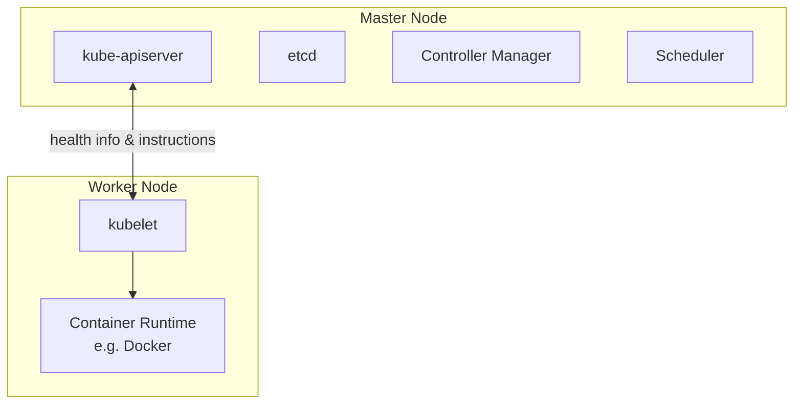

# CKAD Exam Preparation Notes

Condensed concepts from a Udemy CKAD course, for quick review before the exam.

## Table of Contents
1. [Kubernetes Basic Concepts (Nodes, Cluster, Master, Components)](#1-kubernetes-basic-concepts)

---

## 1. Kubernetes Basic Concepts

**Node**
- A physical or virtual machine with Kubernetes installed.
- A *worker* machine where containers are actually launched.
- Formerly called a **minion**.

**Cluster**
- A set of nodes grouped together.
- Provides fault tolerance (if one node fails, app stays accessible on others) and load sharing.

**Master**
- A node configured to manage the cluster.
- Watches over worker nodes and orchestrates containers across them.

### Core Components (installed with Kubernetes)

| Component | Role |
|---|---|
| **kube-apiserver** | Frontend for Kubernetes; all interactions (CLI, UI, tools) go through it |
| **etcd** | Distributed, reliable key-value store holding all cluster data; also handles locking to avoid conflicts between multiple masters |
| **kubelet** | Agent on each worker node; ensures containers are running as expected |
| **Container runtime** | Software that runs containers (e.g. Docker, rkt, CRI-O) |
| **Controller** | "Brain" of orchestration — detects nodes/containers/endpoints going down and decides on remediation |
| **Scheduler** | Distributes/assigns newly created containers to nodes |

### Master vs Worker Node — Component Distribution

- **Master** = has the `kube-apiserver` (this is what defines it as master), plus etcd, controller manager, scheduler.
- **Worker/Minion** = has `kubelet`, which talks to the master (reports health, executes actions) + container runtime to actually run containers.

### kubectl (Kube Control CLI)
Used to deploy/manage applications and inspect the cluster.

| Command | Purpose |
|---|---|
| `kubectl run` | Deploy an application on the cluster |
| `kubectl cluster-info` | View cluster information |
| `kubectl get nodes` | List all nodes in the cluster |

---