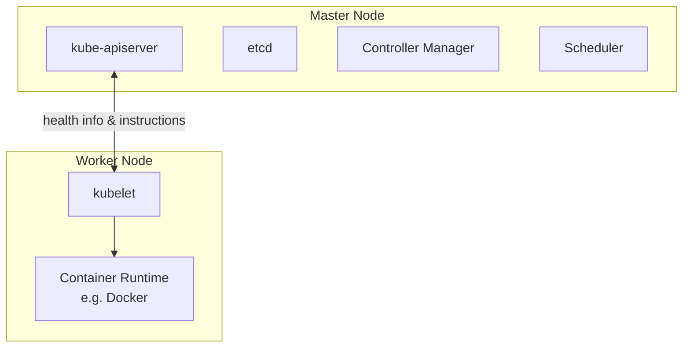
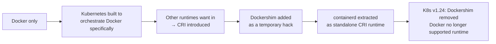
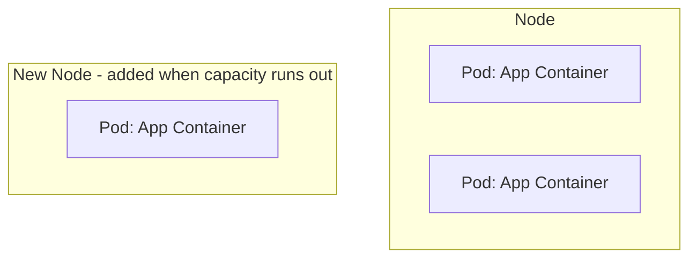
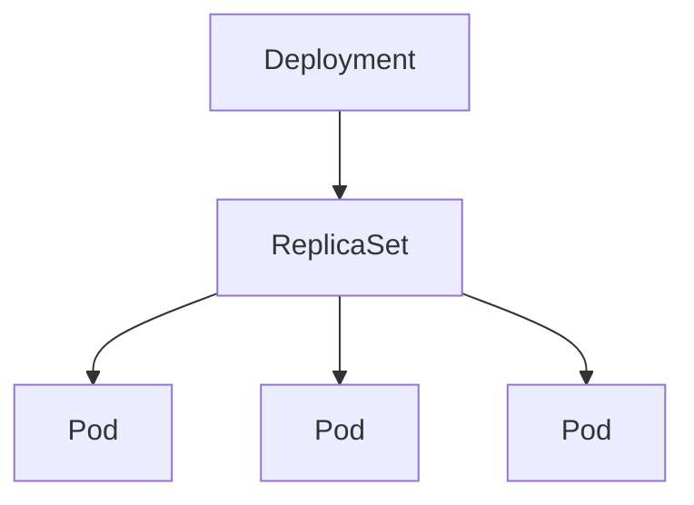
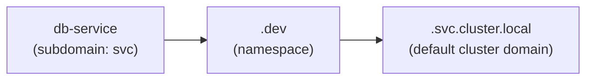
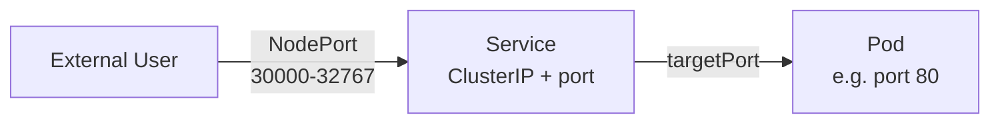
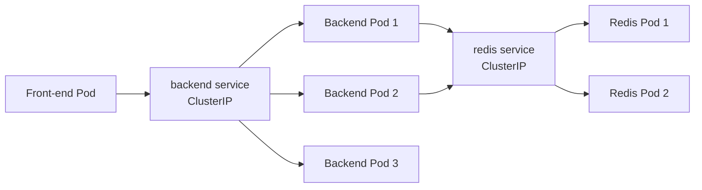
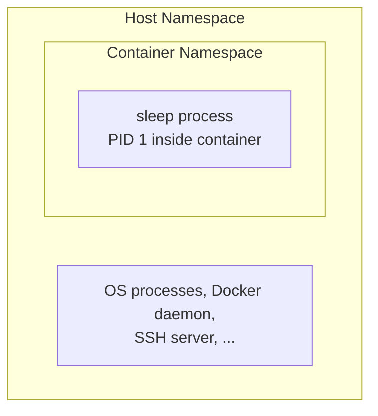
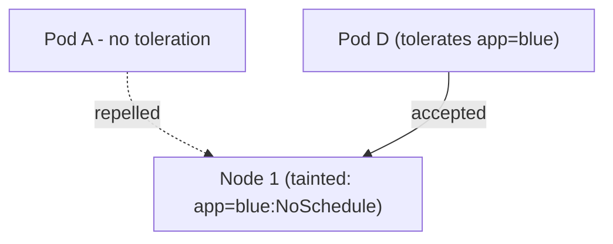
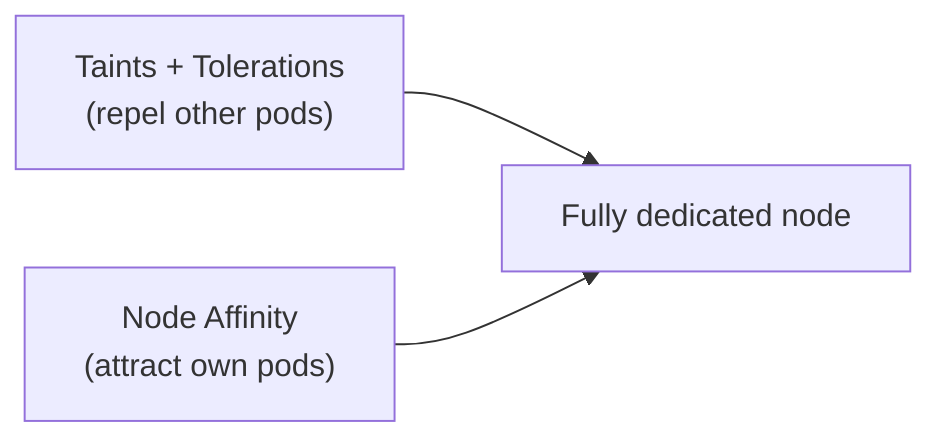

# CKAD Exam Preparation Notes

Condensed concepts from a Udemy CKAD course, for quick review before the exam.

## Table of Contents
1. [Kubernetes Basic Concepts (Nodes, Cluster, Master, Components)](#1-kubernetes-basic-concepts)
2. [Docker vs containerd (Container Runtimes & CLI Tools)](#2-docker-vs-containerd)
3. [Pods — Basic Concepts](#3-pods--basic-concepts)
4. [Pods — YAML Definition Files](#4-pods--yaml-definition-files)
5. [Replication Controllers & ReplicaSets](#5-replication-controllers--replicasets)
6. [Deployments](#6-deployments)
7. [Namespaces](#7-namespaces)
8. [Services — NodePort](#8-services--nodeport)
9. [Services — ClusterIP](#9-services--clusterip)
10. [Imperative Commands (Exam Tip)](#10-imperative-commands-exam-tip)
11. [kubectl explain & api-resources](#11-kubectl-explain--api-resources)
12. [Docker Images & Dockerfile](#12-docker-images--dockerfile)
13. [Docker Commands, Arguments & Entrypoint](#13-docker-commands-arguments--entrypoint)
14. [Pod Commands & Arguments](#14-pod-commands--arguments)
15. [Environment Variables in Pods](#15-environment-variables-in-pods)
16. [ConfigMaps](#16-configmaps)
17. [Secrets](#17-secrets)
18. [Encrypting Secret Data at Rest (etcd)](#18-encrypting-secret-data-at-rest-etcd)
19. [Docker Security Basics](#19-docker-security-basics)
20. [Kubernetes Security Context](#20-kubernetes-security-context)
21. [Resource Requirements — Requests, Limits & Quotas](#21-resource-requirements--requests-limits--quotas)
22. [Service Accounts](#22-service-accounts)
23. [Taints & Tolerations](#23-taints--tolerations)
24. [Node Selectors](#24-node-selectors)
25. [Node Affinity](#25-node-affinity)
26. [Taints/Tolerations + Node Affinity Combined](#26-taintstolerations--node-affinity-combined)

---

## 1. Kubernetes Basic Concepts

**Node**
- A physical or virtual machine with Kubernetes installed.
- A *worker* machine where containers are actually launched.
- Formerly called a **minion**.

**Cluster**
- A set of nodes grouped together.
- Provides fault tolerance (if one node fails, app stays accessible on others) and load sharing.

**Master**
- A node configured to manage the cluster.
- Watches over worker nodes and orchestrates containers across them.

### Core Components (installed with Kubernetes)

| Component | Role |
|---|---|
| **kube-apiserver** | Frontend for Kubernetes; all interactions (CLI, UI, tools) go through it |
| **etcd** | Distributed, reliable key-value store holding all cluster data; also handles locking to avoid conflicts between multiple masters |
| **kubelet** | Agent on each worker node; ensures containers are running as expected |
| **Container runtime** | Software that runs containers (e.g. Docker, rkt, CRI-O) |
| **Controller** | "Brain" of orchestration — detects nodes/containers/endpoints going down and decides on remediation |
| **Scheduler** | Distributes/assigns newly created containers to nodes |

### Master vs Worker Node — Component Distribution



- **Master** = has the `kube-apiserver` (this is what defines it as master), plus etcd, controller manager, scheduler.
- **Worker/Minion** = has `kubelet`, which talks to the master (reports health, executes actions) + container runtime to actually run containers.

### kubectl (Kube Control CLI)
Used to deploy/manage applications and inspect the cluster.

| Command | Purpose |
|---|---|
| `kubectl run` | Deploy an application on the cluster |
| `kubectl cluster-info` | View cluster information |
| `kubectl get nodes` | List all nodes in the cluster |

---

## 2. Docker vs containerd

### History / Timeline



- **CRI (Container Runtime Interface)**: standard interface letting any compliant runtime plug into Kubernetes.
- **OCI (Open Container Initiative)**: defines the standards CRI relies on:
  - **Image spec** – how an image should be built.
  - **Runtime spec** – how a container runtime should behave.
- Docker predates CRI, so it never natively implemented it → Kubernetes used **Dockershim** as a bridge.
- **containerd** = the container-runtime piece inside Docker (daemon that manages `runc`), spun out as its own CRI-compliant, CNCF-graduated project. Can be installed independently of Docker.
- **Docker images still work** post-Dockershim removal, because they follow the OCI image spec — only the *runtime* (Docker Engine) was dropped, not image compatibility.

### CLI Tools Comparison

| Tool | From | Works with | Purpose | Production use? |
|---|---|---|---|---|
| `docker` | Docker | Docker Engine | Full-featured CLI (build, run, volumes, network, security) | ✅ (when Docker present) |
| `ctr` | containerd community | containerd only | Debugging containerd; very limited features | ❌ Debugging only |
| `nerdctl` | containerd community | containerd only | Docker-like CLI for containerd; general purpose, supports more features than Docker (lazy pulling, encrypted images, P2P distribution, image signing, namespaces) | ✅ Recommended replacement for `docker` |
| `crictl` | Kubernetes community | Any CRI-compatible runtime (containerd, CRI-O, etc.) | Inspect/debug containers & **pods** from Kubernetes' perspective | ❌ Debugging only |

### Key Command Equivalents

| Action | Docker | nerdctl | crictl |
|---|---|---|---|
| Run container | `docker run` | `nerdctl run` | ⚠️ possible but not recommended |
| List containers | `docker ps` | `nerdctl ps` | `crictl ps` |
| Pull image | `docker pull` | `nerdctl pull` | `crictl pull` (via `ctr images pull` too) |
| Exec into container | `docker exec -it <id> <cmd>` | `nerdctl exec -it` | `crictl exec -i -t <id> <cmd>` |
| View logs | `docker logs` | `nerdctl logs` | `crictl logs` |
| List pods | N/A (Docker unaware of pods) | N/A | `crictl pods` ✅ unique |

> ⚠️ **Don't create containers with `crictl`/`ctr` in a running cluster** — kubelet doesn't know about them and will delete them, since they're outside its managed state.

### Endpoint Resolution (crictl)
Default connection attempt order: **dockershim → containerd → CRI-O → docker.sock**

Override with:
- `crictl --runtime-endpoint <endpoint>`, or
- Environment variable `CONTAINER_RUNTIME_ENDPOINT`

### Practical Takeaway
- Old labs/docs → `docker` commands.
- Modern clusters (containerd-based) → use `crictl` for troubleshooting/debugging on nodes, `nerdctl` if you need a general-purpose Docker-like CLI.

> 📌 **Note: "Docker deprecation" ≠ Docker disappearing.** Only Docker-*as-Kubernetes-runtime* was deprecated (K8s no longer needs Docker's CLI/API/build tools since containerd handles the CRI side). Docker itself is still widely used for local dev/builds. Course examples may still use `docker` commands for teaching purposes — if you only have containerd, substitute `nerdctl` in place of `docker` in most cases.

---

## 3. Pods — Basic Concepts

- Kubernetes does **not** deploy containers directly on worker nodes — containers are encapsulated inside a **Pod**.
- A **Pod** = smallest deployable object in Kubernetes = (usually) a single instance of an application.

### Pods & Scaling

- Relationship between pods and containers is typically **1:1**.
- To scale **up**: create **new pods** (not new containers inside an existing pod).
- To scale **down**: delete existing pods.
- If a node runs out of capacity, add a **new node** and schedule additional pods there.



### Multi-Container Pods

- A pod *can* contain multiple containers, but usually **not multiple copies of the same container** (that's what extra pods are for).
- Valid use case: a **helper/sidecar container** supporting the main app (e.g. processing uploaded files, fetching data).

Containers in the same pod share:
| Shared resource | Detail |
|---|---|
| **Network namespace** | Can talk to each other via `localhost` |
| **Storage/volumes** | Can share the same volume space |
| **Lifecycle ("fate")** | Created together, destroyed together |

- Kubernetes automates what you'd otherwise do manually with plain Docker: linking containers, custom networks, shared volumes, and monitoring/restarting dependent containers.
- ⚠️ **Multi-container pods are a rare use case** — course (and most real-world basic setups) sticks to **single container per pod**.

### Deploying & Inspecting Pods

| Command | Purpose |
|---|---|
| `kubectl run <name> --image=<image>` | Creates a pod and deploys a container from the given image (pulled from Docker Hub by default, or a private repo if configured) |
| `kubectl get pods` | Lists pods and their status (e.g. `ContainerCreating` → `Running`) |

- At this stage (just a pod, no Service yet), the app is only accessible **internally from the node** — external access requires Services/networking (covered later).

---

## 4. Pods — YAML Definition Files

Every Kubernetes definition file has **4 required top-level fields**:

| Field | Type | Purpose |
|---|---|---|
| `apiVersion` | string | API version used to create the object (e.g. `v1` for pods; others: `apps/v1`, `extensions/v1beta1`) |
| `kind` | string | Type of object (`Pod`, `ReplicaSet`, `Deployment`, `Service`, ...) |
| `metadata` | dictionary | Data *about* the object: `name`, `labels` (only fields Kubernetes expects — can't add arbitrary keys here) |
| `spec` | dictionary | Object-specific configuration (structure differs per `kind` — check docs) |

### YAML Structure Rules (as applied to K8s)
- `metadata.name` → string; `metadata.labels` → a nested dictionary of **arbitrary** key-value pairs (unlike `metadata` itself).
- Siblings (e.g. `name` and `labels`) must have **equal indentation**, and **more indentation than their parent** (`metadata`).
- Labels are useful for grouping/filtering objects later (e.g. `app: front-end`, `app: back-end`, `app: database`) once you have many pods.

### Pod Spec Example

```yaml
apiVersion: v1
kind: Pod
metadata:
  name: myapp-pod
  labels:
    type: front-end
    app: myapp
spec:
  containers:
    - name: nginx-container
      image: nginx
      ports:
        - containerPort: 8080
```

- `spec.containers` is a **list** (pods can hold multiple containers) — each `-` denotes a list item.
- Each list item is a dictionary with (at least) `name` and `image`.
- `ports` (optional) declares the port(s) the container listens on — informational/documentation purposes; it doesn't by itself expose the port outside the pod (that's what a Service is for).

### Commands

| Command | Purpose |
|---|---|
| `kubectl create -f pod-definition.yaml` | Create object(s) from a YAML file |
| `kubectl get pods` | List pods |
| `kubectl get pods -o wide` | List pods with extra details (Node, IP, etc.) |
| `kubectl describe pod <name>` | Detailed info: creation time, labels, containers, associated events |
| `kubectl delete deployment <name>` | Remove a deployment (e.g. cleanup before creating a fresh pod) |

> 💡 **Editor tip**: An IDE with YAML support (e.g. PyCharm, VS Code) shows the document as a tree structure, which helps confirm indentation/hierarchy is correct — useful for catching sibling vs. child mistakes (e.g. `name`/`labels` both under `metadata`). Multiple items under `containers:` show as "item 1 of N", "item 2 of N", confirming it's parsed as a list.

### ✏️ Editing Existing Pods (exam tip)

- **If given a pod definition file**: edit the file, delete the old pod, recreate it (`kubectl delete pod <name>` → `kubectl create -f <file>`).
- **If not given a file**, extract it first:
  ```bash
  kubectl get pod <pod-name> -o yaml > pod-definition.yaml
  ```
  Then edit → delete → recreate.
- **`kubectl edit pod <pod-name>`** opens the live definition in an editor and applies changes directly — but **only these fields are editable in-place**:
  - `spec.containers[*].image`
  - `spec.initContainers[*].image`
  - `spec.activeDeadlineSeconds`
  - `spec.tolerations`
  - `spec.terminationGracePeriodSeconds`
- Anything else (e.g. changing the container's `name`, adding a container, changing ports) → **must delete & recreate** the pod, since pods are largely immutable.

**What actually happens if you try to `kubectl edit` a non-editable field:**
1. `kubectl edit pod <name>` opens the spec in vi.
2. You edit a non-editable field (e.g. env vars, resources, service account) and save → **save is denied**.
3. Kubernetes still writes your edited version to a **temporary file** (e.g. `/tmp/kubectl-edit-ccvrq.yaml`) — the path is shown in the error message.
4. Delete the running pod: `kubectl delete pod <name>`
5. Create a new one from that temp file: `kubectl create -f /tmp/kubectl-edit-ccvrq.yaml`

> Both this "edit → denied → use temp file" flow and the manual "get -o yaml → edit → delete → recreate" flow achieve the same result — use whichever's more convenient.

### ✏️ Editing Deployments (much easier!)
- A **Deployment** owns a pod *template*, so editing **any** field of the pod spec is allowed.
- `kubectl edit deployment <name>` — the Deployment controller automatically deletes the old pod(s) and creates new ones matching the updated template.
- No manual delete/recreate dance needed — this is one advantage of managing pods via Deployments rather than bare pods.

---

## 5. Replication Controllers & ReplicaSets

### Why replication?
- **High availability**: if a pod crashes, a replacement is automatically created.
- **Load sharing**: multiple pods share user load; can scale across multiple nodes.
- Works even for a **single desired replica** — it still auto-recreates a failed pod.

### ReplicationController (RC) vs ReplicaSet (RS)

| | ReplicationController | ReplicaSet |
|---|---|---|
| Status | Older, legacy | Newer, **recommended** |
| `apiVersion` | `v1` | `apps/v1` |
| `selector` required? | No (defaults to pod template's labels if omitted) | **Yes** — must be explicitly defined (`matchLabels`) |
| Can manage pre-existing pods (not created by it) | Limited | Yes, via label selector matching |
| Selector matching options | Basic | More powerful (supports `matchExpressions`, etc.) |

> ⚠️ Using `v1` instead of `apps/v1` for a ReplicaSet gives: `no matches for kind "ReplicaSet"`.

### Definition File Structure

Both RC and RS nest a **pod template** inside `spec`. Structure = parent object wrapping a pod definition:

#### ReplicationController example

```yaml
apiVersion: v1
kind: ReplicationController
metadata:
  name: myapp-rc
  labels:
    app: myapp
    type: front-end
spec:
  replicas: 3
  template:
    # All Pod's metadata and spec go here
    metadata:
      labels:
        app: myapp
        type: front-end
    spec:
      containers:
        - name: nginx-container
          image: nginx
```

#### ReplicaSet example

```yaml
apiVersion: apps/v1
kind: ReplicaSet
metadata:
  name: myapp-replicaset
  labels:
    app: myapp
    type: front-end
spec:
  replicas: 3
  selector:
    matchLabels:
      type: front-end
  template:
    # All Pod's metadata and spec go here
    metadata:
      labels:
        app: myapp
        type: front-end
    spec:
      containers:
        - name: nginx-container
          image: nginx
```

### Side-by-side diff

| | ReplicationController | ReplicaSet |
|---|---|---|
| `apiVersion` | `v1` | `apps/v1` |
| `kind` | `ReplicationController` | `ReplicaSet` |
| `spec.replicas` | ✅ | ✅ |
| `spec.selector` | ❌ not required (defaults to matching `template.metadata.labels`) | ✅ **required**, written as `matchLabels` |
| `spec.template` | ✅ | ✅ |

The only structural differences are: **`apiVersion`**, **`kind`**, and the **mandatory `selector`** block in ReplicaSet. Everything else (`metadata`, `spec.replicas`, `spec.template`) is written identically.

- `spec.template` = pod definition **minus** its own `apiVersion`/`kind` (those two lines are dropped; everything else nests under `template`).
- `spec.replicas` and `spec.template` (and `spec.selector` for RS) are **siblings** — same indentation level under `spec`.
- `selector.matchLabels` **must match** the labels in `template.metadata.labels` (and/or on any existing pods you want the RS to adopt).

### Labels & Selectors — Why They Matter
- ReplicaSet is a **monitoring process**: it watches for pods matching its selector and ensures the desired count is met.
- It can **adopt pre-existing pods** that match the selector (won't create duplicates if enough already exist) — but the `template` is still required, since it's needed if a replacement pod must be created later.

### Commands

| Command | Purpose |
|---|---|
| `kubectl create -f rc-definition.yaml` | Create RC or RS from file |
| `kubectl get replicationcontroller` | List RCs |
| `kubectl get replicaset` (or `rs`) | List RSs |
| `kubectl get pods` | Pods created show a name prefixed by the RC/RS name |
| `kubectl delete replicaset <name>` | Delete RS (also deletes its pods) |
| `kubectl replace -f <file>` | Replace/update object from file |
| `kubectl apply -f <file>` | Apply updated definition file (e.g. after editing `replicas` count) |
| `kubectl scale --replicas=6 -f <file>` | Scale via CLI using file reference |
| `kubectl scale --replicas=6 replicaset <name>` | Scale via CLI using type/name (doesn't update the YAML file) |

> 📌 Scaling via `kubectl scale` does **not** update the replica count inside the definition file — the file and live cluster state can drift out of sync.

---

## 6. Deployments

### Kubernetes Object Hierarchy



- **Pod** → single instance of an application.
- **ReplicaSet** → ensures N pods are running.
- **Deployment** → sits above ReplicaSet; provides production-grade capabilities:
  - **Rolling updates** — upgrade instances one at a time (not all at once), avoiding user impact.
  - **Rollback** — undo a problematic update.
  - **Pause & Resume** — batch multiple changes (e.g. image upgrade + scaling + resource limits) and apply them together as one rollout instead of one-by-one.

### Definition File

Nearly identical to a ReplicaSet definition — only `kind` differs:

```yaml
apiVersion: apps/v1
kind: Deployment
metadata:
  name: myapp-deployment
  labels:
    app: myapp
    type: front-end
spec:
  replicas: 3
  selector:
    matchLabels:
      type: front-end
  template:
    metadata:
      labels:
        app: myapp
        type: front-end
    spec:
      containers:
        - name: nginx-container
          image: nginx
```

### What Happens on Creation
`kubectl create -f deployment-definition.yaml` →
1. Creates a **Deployment**
2. Which automatically creates a **ReplicaSet** (named after the deployment)
3. Which automatically creates **Pods** (named after the deployment + replica set)

### Commands

| Command | Purpose |
|---|---|
| `kubectl create -f deployment-definition.yaml` | Create a deployment |
| `kubectl get deployments` | List deployments |
| `kubectl get replicaset` | See the auto-created ReplicaSet |
| `kubectl get pods` | See the auto-created Pods |
| `kubectl get all` | See all created objects (Deployment → ReplicaSet → Pods) at once |

> At this stage, Deployment behaves just like a ReplicaSet — the real value (rolling updates, rollback, pause/resume) is covered in upcoming lectures.

---

## 7. Namespaces

**Analogy**: Two people named "Mark" in different houses (Smiths, Williams) go by first name *within* their house, but need the full name (Mark Smith) when referenced from outside or across houses. Houses = namespaces; each has its own rules and resources.

### Default Namespaces (auto-created by Kubernetes)

| Namespace | Purpose |
|---|---|
| `default` | Where your objects go if you don't specify a namespace |
| `kube-system` | Internal Kubernetes pods/services (networking, DNS, etc.) — isolated to avoid accidental changes |
| `kube-public` | Resources meant to be accessible to **all** users across all namespaces |

### Why Use Namespaces
- Isolate resources between environments (e.g. `dev` vs `prod`) on the **same cluster**.
- Prevent accidental cross-environment changes.
- Apply namespace-specific **policies** and **resource quotas** (limit CPU/memory/pod count per namespace).

### Cross-Namespace Communication (DNS)

- Within the **same** namespace: reference a service simply by its name → `db-service`
- Across namespaces: `<service-name>.<namespace>.svc.cluster.local`
  - e.g. `db-service.dev.svc.cluster.local`


Breakdown: `<service>.<namespace>.svc.cluster.local` — `cluster.local` = default cluster domain, `svc` = subdomain for services.

### Commands

| Command | Purpose |
|---|---|
| `kubectl get pods` | Lists pods in `default` namespace only |
| `kubectl get pods --namespace=kube-system` | List pods in a specific namespace |
| `kubectl create -f pod-definition.yaml --namespace=dev` | Create a pod in a specific namespace (CLI override) |
| `kubectl create namespace dev` | Create a namespace directly via CLI |
| `kubectl get pods --all-namespaces` (or `-A`) | List pods across **all** namespaces |
| `kubectl config current-context` | Show which context is currently active |
| `kubectl config set-context --current --namespace=dev` | Same as above, using `--current` instead of naming the context explicitly |
| `kubectl config set-context --current -n dev` | Same as above, using the short flag `-n` (note: no `=` with short flags) |
| `kubectl config set-context $(kubectl config current-context) --namespace=dev` | Permanently switch the **current context** to a namespace (no need to pass `--namespace` each time) |
| `kubectl config get-contexts` | List all contexts and see which one is currently active |

To permanently bind a pod to a namespace in its YAML (instead of passing `--namespace` every time):
```yaml
apiVersion: v1
kind: Pod
metadata:
  name: myapp-pod
  namespace: dev
  labels:
    app: myapp
spec:
  containers:
    - name: nginx-container
      image: nginx
```

### Creating a Namespace via Definition File

```yaml
apiVersion: v1
kind: Namespace
metadata:
  name: dev
```
`kubectl create -f namespace-dev.yaml`

### Resource Quotas (limit usage per namespace)

```yaml
apiVersion: v1
kind: ResourceQuota
metadata:
  name: compute-quota
  namespace: dev
spec:
  hard:
    pods: "10"
    requests.cpu: "4"
    requests.memory: 5Gi
    limits.cpu: "10"
    limits.memory: 10Gi
```

> 📌 Contexts (used to manage multiple clusters/environments from one `kubectl` setup) are a related but separate topic — covered elsewhere.

---

## 8. Services — NodePort

### Purpose
A **Service** enables communication between pods, and between pods and the outside world (loose coupling between microservices). It's a Kubernetes object like Pods/ReplicaSets/Deployments.

### The Networking Problem
- Each **node** has its own IP (e.g. `192.168.1.2`), on the same network as your laptop.
- Each **pod** has an IP in a separate internal pod network (e.g. `10.244.0.2`) — **not directly reachable** from outside the cluster/node.
- SSH-ing into the node and curling the pod IP works, but isn't practical for external users.
- **Solution**: a **Service** sits in the middle and forwards traffic from an externally-reachable node port → to the pod.

### Service Types

| Type | Behavior |
|---|---|
| **NodePort** | Exposes the service on a static port on every node's IP; external traffic → node port → service → pod |
| **ClusterIP** | Creates a virtual internal IP for service-to-service communication (e.g. front-end → back-end) — default type |
| **LoadBalancer** | Provisions an external load balancer (on supported cloud providers) — e.g. to distribute traffic across front-end web servers |

### NodePort — Three Ports Involved



| Port | Meaning | Constraint |
|---|---|---|
| `targetPort` | Port the app/container listens on inside the pod | Defaults to `port` if omitted |
| `port` | Port on the Service itself (its virtual IP) | **Only mandatory field** |
| `nodePort` | Port exposed on the node's IP for external access | Valid range: **30000–32767**; auto-assigned from that range if omitted |

### Definition File

```yaml
apiVersion: v1
kind: Service
metadata:
  name: myapp-service
spec:
  type: NodePort
  ports:
    - targetPort: 80
      port: 80
      nodePort: 30008    # Range 30000-32767
  selector:
    # Put metadata.labels of Pod here
    app: myapp
    type: front-end
```

- `spec.ports` is a **list** (a service can expose multiple port mappings).
- `spec.selector` links the service to pod(s) — must **match the labels** on the target pod(s) (same labels/selector mechanism as ReplicaSets/Deployments). Without this, the Service has no way to know which pods to forward to.

### Commands

| Command | Purpose |
|---|---|
| `kubectl create -f service-definition.yaml` | Create the service |
| `kubectl get services` (or `svc`) | List services, their ClusterIP, and mapped ports |
| `curl http://<node-ip>:<nodePort>` | Access the app externally |

### Multi-Pod & Multi-Node Behavior (automatic — no extra config needed)

- **Multiple pods, same node**: if several pods share the label matched by the selector, the Service automatically load-balances across all of them using a **random algorithm** (built-in load balancing).
- **Multiple pods across multiple nodes**: Kubernetes automatically maps the **same nodePort** on **every node** in the cluster — so the app is reachable via *any* node's IP + that port, regardless of which node actually hosts the pod.
- Service endpoints update automatically as pods are added/removed (no manual reconfiguration needed).

---

## 9. Services — ClusterIP

### The Problem
A full-stack app typically has multiple tiers: front-end, back-end, cache (Redis), database (MySQL). These tiers need to talk to each other, but:
- Pod IPs are **ephemeral** — pods die/restart, IPs change constantly.
- With multiple pods per tier, **which one** should another pod connect to, and who decides?

### The Solution: ClusterIP
A **ClusterIP** service groups a set of pods (e.g. all backend pods) and exposes **one stable internal IP + DNS name** as the single access point. Requests to the service are forwarded to one of the grouped pods (**randomly**).



- Enables clean microservices architecture: each tier can scale, move, or be replaced without breaking communication — other pods only ever talk to the **service name**, never pod IPs directly.
- **ClusterIP is the default service type** — if `type` is omitted, it defaults to ClusterIP.

### Definition File

```yaml
apiVersion: v1
kind: Service
metadata:
  name: back-end
spec:
  type: ClusterIP     # default type, can be omitted
  ports:
    - targetPort: 80
      port: 80
  selector:
    # Put metadata.labels of Pod here
    app: myapp
    type: back-end
```

- `targetPort` = port the backend pods expose; `port` = port on the service itself.
- `selector` links the service to pods, same pattern as NodePort — copy the labels from the target pod definition.

### Commands

| Command | Purpose |
|---|---|
| `kubectl create -f service-definition.yaml` | Create the service |
| `kubectl get services` (or `svc`) | Check status, ClusterIP, ports |

- Other pods reach it via the **service name** (DNS) or its **ClusterIP** — never via individual pod IPs.

---

## 10. Imperative Commands (Exam Tip) ⭐

Declarative (YAML files) is the standard approach, but **imperative commands save major time** on the exam — both for quick one-off tasks and for generating a YAML template to then edit.

### Key Flags

| Flag | Purpose |
|---|---|
| `--dry-run=client` | Doesn't actually create the resource — just validates the command |
| `-o yaml` | Outputs the resource definition as YAML instead of creating it |
| Combined + `>` redirect | Generates a YAML file to edit, instead of writing one from scratch |

```bash
kubectl run nginx --image=nginx --dry-run=client -o yaml > nginx-pod.yaml
```

### Pod

| Task | Command |
|---|---|
| Create an nginx pod | `kubectl run nginx --image=nginx` |
| Generate pod YAML only (no creation) | `kubectl run nginx --image=nginx --dry-run=client -o yaml` |

### Deployment

| Task | Command |
|---|---|
| Create a deployment | `kubectl create deployment nginx --image=nginx` |
| Generate deployment YAML only | `kubectl create deployment nginx --image=nginx --dry-run=client -o yaml` |
| Create with 4 replicas directly | `kubectl create deployment nginx --image=nginx --replicas=4` |
| Scale an existing deployment | `kubectl scale deployment nginx --replicas=4` |
| Generate YAML to file, then edit before creating | `kubectl create deployment nginx --image=nginx --dry-run=client -o yaml > nginx-deployment.yaml` |

### Service

**ClusterIP** — expose pod `redis` on port 6379 as `redis-service`:
```bash
kubectl expose pod redis --port=6379 --name redis-service --dry-run=client -o yaml
```
- ✅ Automatically uses the **pod's actual labels** as selectors.

Alternative:
```bash
kubectl create service clusterip redis --tcp=6379:6379 --dry-run=client -o yaml
```
- ⚠️ Does **not** use the pod's labels — assumes selector `app=redis` and you **cannot pass in custom selectors** via CLI. Only safe if your pod's label happens to match; otherwise generate the file and edit the selector manually.

**NodePort** — expose pod `nginx` port 80 as `nginx-service`, nodePort 30080:
```bash
kubectl expose pod nginx --port=80 --name nginx-service --type=NodePort --dry-run=client -o yaml
```
- ✅ Uses pod's labels as selectors, but ⚠️ **cannot specify the nodePort** via this command — must generate the file and manually add `nodePort: 30080` before creating.

Alternative:
```bash
kubectl create service nodeport nginx --tcp=80:80 --node-port=30080 --dry-run=client -o yaml
```
- ✅ Can specify nodePort, but ⚠️ does **not** use the pod's labels as selectors.

> 💡 **Recommendation**: prefer `kubectl expose` (keeps correct selectors). If you need a specific `nodePort`, generate the YAML with `expose` + `--dry-run=client -o yaml`, then manually add the `nodePort` field before applying.

### Output Formatting (`-o`)

```
kubectl [command] [TYPE] [NAME] -o <output_format>
```

| Format | Result |
|---|---|
| `-o json` | Full resource as JSON |
| `-o yaml` | Full resource as YAML |
| `-o name` | Just the resource name |
| `-o wide` | Plain-text table + extra columns (e.g. IP, Node) |

```bash
kubectl get pods -o wide
# NAME      READY   STATUS    RESTARTS   AGE     IP          NODE     ...
```

> Combine with `--dry-run=client` to preview a resource's YAML/JSON without creating it (see examples above).

---

## 11. kubectl explain & api-resources ⭐

Useful for exploring resources and fields **without leaving the terminal / docs**.

| Command | Purpose |
|---|---|
| `kubectl api-resources` | List **all** resource types: their name, short name, API group/version, whether namespaced. Great when you forget a resource's exact name, short name, or correct casing |
| `kubectl explain pod` | Shows **top-level** fields of a resource (`apiVersion`, `kind`, `metadata`, `spec`, `status`) with type + description |
| `kubectl explain pod.spec` | Drills into a specific field's **subfields** (still only one level deep at a time) |
| `kubectl explain pod --recursive` | Outputs the **entire nested field structure** at once — the fastest way to see everything available for a YAML file |

> 💡 Use `api-resources` to find the resource name → `explain <resource> --recursive` to see the full field tree → build your YAML confidently without needing the docs website.

---

## 12. Docker Images & Dockerfile

### Why Build Your Own Image
- No suitable image exists on Docker Hub for what you need, or
- You want to Dockerize your own application for easier shipping/deployment.

### Workflow


### Dockerfile Format
Instruction (CAPS) + argument, one per line:

```dockerfile
FROM Ubuntu

RUN apt-get update
RUN apt-get install python

RUN pip install flask
RUN pip install flask-mysql

COPY . /opt/source-code

ENTRYPOINT FLASK_APP=/opt/source-code/app.py flask run
```

| Instruction | Purpose |
|---|---|
| `FROM` | **Required as the first line** — defines the base image/OS (every image must be based on another image, ultimately an OS) |
| `RUN` | Executes a command while building the image (e.g. install packages) |
| `COPY` | Copies files from local system into the image |
| `ENTRYPOINT` | Command executed when a container is run from this image |

### Layered Architecture
- Each instruction/line creates a **new layer**, storing only the **diff** from the previous layer.
- Layers are **cached** by Docker:
  - If a build step fails, fixing it and rebuilding **reuses cached layers** up to that point instead of starting over.
  - If you add new instructions, only layers **from that point onward** need rebuilding — faster iteration, especially when just updating app source code (put frequently-changing steps, like `COPY` of source code, later in the file).
- `docker history <image>` shows each layer and its size contribution.

### Commands

| Command | Purpose |
|---|---|
| `docker build -t <account>/<image-name> .` | Build image from Dockerfile in current directory |
| `docker push <account>/<image-name>` | Publish image to Docker Hub |
| `docker history <image-name>` | Show layers and their sizes |

### Running Containers — Common `docker run` Options

| Command | Purpose |
|---|---|
| `docker run <image>` | Run a container from an image |
| `docker run -d <image>` | Run in **detached** mode (background) |
| `docker run --name <container-name> <image>` | Give the container a custom name |
| `docker run -p <host-port>:<container-port> <image>` | **Port mapping** — e.g. `-p 8080:80` maps host port 8080 → container port 80 |
| `docker run -v <host-path>:<container-path> <image>` | **Volume mapping** — mount a host directory into the container |
| `docker run -e <VAR_NAME>=<value> <image>` | Set an **environment variable** inside the container |
| `docker run -it <image> <command>` | **Interactive** mode with a **terminal** attached (e.g. to get a shell: `docker run -it ubuntu bash`) |
| `docker run --rm <image>` | Automatically **remove** the container once it exits |
| `docker run --network <network-name> <image>` | Attach to a specific Docker network |

**Combined example:**
```bash
docker run -d --name myapp -p 8080:80 -v /host/data:/app/data -e APP_COLOR=blue myimage
```
Runs `myimage` in the background, named `myapp`, mapping host port 8080 to container port 80, mounting `/host/data` into `/app/data`, and setting `APP_COLOR=blue`.

### Checking the Base OS Distro of an Image

`docker inspect <image>` shows `"Os": "linux"` — this only confirms the OS **family** (Linux vs Windows), **not** the specific distro (Debian, Alpine, Ubuntu, etc.).

To find the actual base distro, run a throwaway container and check `/etc/os-release`:
```bash
docker run --rm webapp-color cat /etc/os-release
```
- `--rm` auto-removes the container once the command finishes.
- Output reveals the real distro, e.g. `Debian GNU/Linux` or `Alpine Linux`.

> 💡 Image tag variants matter: `python:3.14` (full Debian-based) and `python:3.14-slim` (same Debian base, fewer packages, smaller) are both Debian — only a tag like `python:3.14-alpine` actually switches the base OS to **Alpine** (different libc: `musl` vs `glibc`, which can affect package compatibility).

> 📌 Almost anything can be containerized — not just servers/databases, but dev tools, browsers, utilities, even desktop apps.

---

## 13. Docker Commands, Arguments & Entrypoint

> Not strictly in the CKAD curriculum, but foundational for understanding Pod `command`/`args` (next section).

### Why Containers Exit
- Containers are **not** VMs — they don't host a full OS, they run **one process/task**.
- A container's lifetime = its main process's lifetime. When that process ends (or crashes), the container exits.
- `docker run ubuntu` exits almost immediately because the Ubuntu image's default command is `bash` — a shell that needs a terminal; with no terminal attached, it exits instantly → container exits too.

### CMD vs ENTRYPOINT

| Instruction | Role | Behavior when you pass args to `docker run` |
|---|---|---|
| `CMD` | Default command **and/or default args** | Fully **replaced** by whatever you pass on the command line |
| `ENTRYPOINT` | The fixed **executable** to run | Whatever you pass gets **appended** to it |

```dockerfile
# CMD only
FROM ubuntu
CMD ["sleep", "5"]
```
`docker run ubuntu-sleeper 10` → runs `sleep 10` (CMD fully overridden)

```dockerfile
# ENTRYPOINT only
FROM ubuntu
ENTRYPOINT ["sleep"]
```
`docker run ubuntu-sleeper 10` → runs `sleep 10` (10 appended to entrypoint)
`docker run ubuntu-sleeper` (no args) → runs just `sleep` → **error: operand missing**

```dockerfile
# ENTRYPOINT + CMD combined (best of both — default value with override capability)
FROM ubuntu
ENTRYPOINT ["sleep"]
CMD ["5"]
```
- No args passed → `CMD` value used as default arg → `sleep 5`
- Args passed (`docker run ubuntu-sleeper 10`) → overrides `CMD`, appended to `ENTRYPOINT` → `sleep 10`

> ⚠️ Both `ENTRYPOINT` and `CMD` should be written in **JSON array format**, with the executable as the **first element**, for this combination to work correctly:
> ✅ `["sleep", "5"]` — correct
> ❌ `["sleep 5"]` — wrong (command+params as one string)

### Runtime Overrides

| Goal | How |
|---|---|
| One-off override of `CMD` | Append a command to `docker run <image> <new-command>` |
| Permanently change default command | Build a new image with a modified `CMD`/`ENTRYPOINT` |
| Override `ENTRYPOINT` itself at runtime | `docker run --entrypoint <new-entrypoint> <image> <args>` |

---

## 14. Pod Commands & Arguments

Maps directly onto the Dockerfile `CMD` / `ENTRYPOINT` concepts from Section 13.

| Pod field | Overrides Dockerfile instruction | Behavior |
|---|---|---|
| `spec.containers[].args` | `CMD` | Appends/replaces the default arguments |
| `spec.containers[].command` | `ENTRYPOINT` | Replaces the executable itself |

> ⚠️ **Common trap**: `command` overrides `ENTRYPOINT`, **not** `CMD`. Naming is misleading — remember the mapping, not the words.

### Example

Dockerfile (`ubuntu-sleeper` image):
```dockerfile
FROM ubuntu
ENTRYPOINT ["sleep"]
CMD ["5"]
```

Pod definition overriding both:
```yaml
apiVersion: v1
kind: Pod
metadata:
  name: ubuntu-sleeper-pod
spec:
  containers:
    - name: ubuntu-sleeper
      image: ubuntu-sleeper
      command: ["sleep2.0"]   # overrides ENTRYPOINT
      args: ["10"]            # overrides CMD
```
Resulting startup command: `sleep2.0 10`

- To just change the sleep duration (override `CMD` only): set `args: ["10"]`, omit `command`.
- To change the executable itself (override `ENTRYPOINT`): set `command: [...]`.

---

## 15. Environment Variables in Pods

Set via the `env` property under a container spec:

```yaml
apiVersion: v1
kind: Pod
metadata:
  name: myapp-pod
spec:
  containers:
    - name: myapp-container
      image: myapp
      env:
        - name: APP_COLOR
          value: pink
```

- `env` is a **list** — each item (`-`) is a dict with `name` and `value`.

### Other Ways to Set Env Vars (preview)
Instead of a literal `value`, use `valueFrom` to pull from:
- **ConfigMap** — for regular configuration data
- **Secret** — for sensitive data (passwords, tokens, etc.)

(Covered in detail in the next sections.)

---

## 16. ConfigMaps

### Why
Managing env vars inside every Pod definition file gets unwieldy at scale. **ConfigMaps** centralize configuration data (key-value pairs) so it can be managed independently and injected into pods.

### Two-Step Process
1. **Create** the ConfigMap.
2. **Inject** it into a pod (as env vars, single value, or volume/files).

### Creating a ConfigMap — Imperative

```bash
# Inline key-value pairs
kubectl create configmap app-config --from-literal=APP_COLOR=blue --from-literal=APP_MODE=prod

# From a file (data stored under the file's name)
kubectl create configmap app-config --from-file=app_config.properties
```
- Use `--from-literal` multiple times for multiple pairs (gets unwieldy for many values).

### Creating a ConfigMap — Declarative

```yaml
apiVersion: v1
kind: ConfigMap
metadata:
  name: app-config
data:
  APP_COLOR: blue
  APP_MODE: prod
```
`kubectl create -f config-map.yaml`

> 📌 ConfigMap definitions have `data` instead of `spec` as the fourth top-level field.
> 💡 Name ConfigMaps meaningfully (e.g. one per app/component: `app-config`, `mysql-config`, `redis-config`) — you'll reference these names when wiring them to pods.

### Commands

| Command | Purpose |
|---|---|
| `kubectl get configmaps` | List ConfigMaps |
| `kubectl describe configmap <name>` | View ConfigMap details, including its data |

### Injecting a ConfigMap into a Pod (as env vars)

```yaml
apiVersion: v1
kind: Pod
metadata:
  name: myapp-pod
spec:
  containers:
    - name: myapp-container
      image: myapp
      envFrom:
        - configMapRef:
            name: app-config
```
- `envFrom` is a **list** — you can reference multiple ConfigMaps.
- Every key in the ConfigMap becomes an environment variable in the container.

### Other Injection Methods

**Single environment variable from a specific ConfigMap key:**
```yaml
apiVersion: v1
kind: Pod
metadata:
  name: myapp-pod
spec:
  containers:
    - name: myapp-container
      image: myapp
      env:
        - name: APP_COLOR
          valueFrom:
            configMapKeyRef:
              name: app-config
              key: APP_COLOR
```
- `env` (not `envFrom`) is used here, since we're pulling **one specific key** rather than the whole ConfigMap.
- `valueFrom.configMapKeyRef.name` = the ConfigMap name; `.key` = the specific key to pull.

**As files in a mounted volume:**
```yaml
apiVersion: v1
kind: Pod
metadata:
  name: myapp-pod
spec:
  containers:
    - name: myapp-container
      image: myapp
      volumeMounts:
        - name: app-config-volume
          mountPath: /opt/app-config
  volumes:
    - name: app-config-volume
      configMap:
        name: app-config
```
- Each key in the ConfigMap becomes a **file** inside the mounted directory (`/opt/app-config`), with the key's value as the file's contents.
- Useful when an app expects configuration as files rather than env vars.

---

## 17. Secrets

### Why (vs ConfigMaps)
- ConfigMaps store data in **plain text** — fine for hostnames/usernames, **not safe for passwords/keys**.
- **Secrets** store sensitive data (passwords, tokens, keys) in an **encoded** (base64) format. Same two-step workflow as ConfigMaps: create → inject.

> ⚠️ Base64 encoding is **not encryption** — it's easily reversible. Secrets are still not fully "secure" at rest by default; treat this as basic obfuscation, not real protection, unless additional encryption-at-rest is configured on the cluster.

**On "safety" of Secrets** — anyone with the base64 string can trivially decode it, so Secrets aren't inherently safe *by encoding*. They're "safer" mainly due to **practices and cluster behavior**, not the encoding itself:

- Best practices: don't commit secret definition files to source control; enable [**encryption at rest**](https://kubernetes.io/docs/tasks/administer-cluster/encrypt-data/) for Secrets in etcd.
- Kubernetes' own handling:
  - A secret is only sent to a **node that actually needs it** (has a pod requiring it).
  - `kubelet` stores it in **tmpfs** (in-memory) on the node — never written to disk.
  - When the dependent pod is deleted, `kubelet` deletes its local copy of the secret too.
- For genuinely sensitive data at scale, consider dedicated secret-management tools: **Helm Secrets**, **HashiCorp Vault**, etc. (beyond CKAD scope, but good to know exists).

### Creating a Secret — Imperative

```bash
# Inline key-value pairs
kubectl create secret generic app-secret --from-literal=DB_HOST=mysql --from-literal=DB_PASSWORD=paswrd

# From a file
kubectl create secret generic app-secret --from-file=app_secret.properties
```

### Creating a Secret — Declarative

Values must be **base64-encoded** manually before writing them in the YAML:

```bash
echo -n 'mysql' | base64        # → bXlzcWw=
echo -n 'root' | base64         # → cm9vdA==
echo -n 'paswrd' | base64       # → cGFzd3Jk
```

```yaml
apiVersion: v1
kind: Secret
metadata:
  name: app-secret
data:
  DB_HOST: bXlzcWw=
  DB_USER: cm9vdA==
  DB_PASSWORD: cGFzd3Jk
```
`kubectl create -f secret-data.yaml`

> 📌 Same top-level structure as ConfigMap (`apiVersion`, `kind`, `metadata`, `data`) — only difference: `kind: Secret` and base64-encoded values.

### Commands

| Command | Purpose |
|---|---|
| `kubectl get secrets` | List secrets (includes some Kubernetes-internal secrets too) |
| `kubectl describe secret <name>` | Shows secret **attributes/keys only** — values are hidden |
| `kubectl get secret <name> -o yaml` | Shows the **base64-encoded values** |
| `echo -n '<value>' \| base64` | Encode a value |
| `echo -n '<encoded>' \| base64 --decode` | Decode a value back to plain text |

### Injecting a Secret into a Pod (as env vars)

```yaml
apiVersion: v1
kind: Pod
metadata:
  name: myapp-pod
spec:
  containers:
    - name: myapp-container
      image: myapp
      envFrom:
        - secretRef:
            name: app-secret
```
- `envFrom` + `secretRef` — same pattern as `configMapRef`, all keys become env vars.

### Single Env Var from a Secret

```yaml
env:
  - name: DB_PASSWORD
    valueFrom:
      secretKeyRef:
        name: app-secret
        key: DB_PASSWORD
```

### Secret as Mounted Volume (files)

```yaml
apiVersion: v1
kind: Pod
metadata:
  name: myapp-pod
spec:
  containers:
    - name: myapp-container
      image: myapp
      volumeMounts:
        - name: app-secret-volume
          mountPath: /opt/app-secret
  volumes:
    - name: app-secret-volume
      secret:
        secretName: app-secret
```
- Each key in the secret becomes a **file** in the mount path, with the **decoded** value as file content (e.g. `/opt/app-secret/DB_PASSWORD` contains the plain password).

### ConfigMap vs Secret — Quick Comparison

| | ConfigMap | Secret |
|---|---|---|
| Purpose | Non-sensitive config | Sensitive data (passwords, keys, tokens) |
| Storage format | Plain text | Base64-encoded |
| `kind` | `ConfigMap` | `Secret` |
| Create imperative | `kubectl create configmap ...` | `kubectl create secret generic ...` |
| Injection methods | `envFrom`/`env`+`configMapKeyRef`/volume | `envFrom`/`env`+`secretKeyRef`/volume |

---

## 18. Encrypting Secret Data at Rest (etcd)

### The Problem
- Secrets are only **base64-encoded**, not encrypted.
- By default, secret data is stored in **etcd in plain (unencrypted) form** — anyone with etcd access can read all secrets, even without needing to decode anything.

### Checking Whether Encryption-at-Rest Is Enabled
```bash
ps -aux | grep kube-apiserver | grep encryption-provider-config
```
- No result → encryption at rest is **not enabled**.
- Can also inspect the static pod manifest directly (kubeadm setups): `/etc/kubernetes/manifests/kube-apiserver.yaml` — look for `--encryption-provider-config`.

### Inspecting Raw Secret Data in etcd (to prove the problem)
```bash
ETCDCTL_API=3 etcdctl \
  --cacert=/etc/kubernetes/pki/etcd/ca.crt \
  --cert=/etc/kubernetes/pki/etcd/server.crt \
  --key=/etc/kubernetes/pki/etcd/server.key \
  get /registry/secrets/default/my-secret | hexdump -C
```
- etcd stores secrets under path: `/registry/secrets/<namespace>/<secret-name>`
- The `hexdump`/text output reveals the value **in plain readable text** if encryption isn't enabled.

### Enabling Encryption at Rest

**1. Create an `EncryptionConfiguration` file** (e.g. `/etc/kubernetes/enc/enc.yaml`):
```yaml
apiVersion: apiserver.config.k8s.io/v1
kind: EncryptionConfiguration
resources:
  - resources:
      - secrets
    providers:
      - aescbc:
          keys:
            - name: key1
              secret: <base64-encoded-32-byte-key>
      - identity: {}
```

| Field | Notes |
|---|---|
| `resources` | Which resource types to encrypt (e.g. just `secrets` — you don't have to encrypt everything) |
| `providers` | A **list** — order matters! |

- Providers include: `identity` (no encryption — the default/no-op), `aescbc`, `aesgcm`, `secretbox`, etc.
- **The first provider in the list is used for encryption.** Subsequent ones are only tried for decryption (e.g. for backward compatibility during a migration).
- ⚠️ If `identity` is listed **first**, nothing gets encrypted — put your real encryption provider (e.g. `aescbc`) first, `identity` last.
- Generate a random 32-byte base64 key: `head -c 32 /dev/urandom | base64`

**2. Store the file where the API server can reach it**, e.g. `/etc/kubernetes/enc/enc.yaml` on the control-plane node.

**3. Edit the kube-apiserver static pod manifest** (`/etc/kubernetes/manifests/kube-apiserver.yaml`):
- Add the flag: `--encryption-provider-config=/etc/kubernetes/enc/enc.yaml`
- Add a **volume mount** in the container spec pointing to that path inside the pod.
- Add the corresponding **volume** (hostPath) pointing to the local directory containing the file.
- Saving this file causes kubeadm to **automatically restart** the kube-apiserver static pod.

```yaml
spec:
  containers:
  - command:
    - kube-apiserver
    ...
    - --encryption-provider-config=/etc/kubernetes/enc/enc.yaml  # add this line
    volumeMounts:
    ...
    - name: enc                           # add this line
      mountPath: /etc/kubernetes/enc      # add this line
      readOnly: true                      # add this line
    ...
  volumes:
  ...
  - name: enc                             # add this line
    hostPath:                             # add this line
      path: /etc/kubernetes/enc           # add this line
      type: DirectoryOrCreate             # add this line
```

- `volumes[].name` and `volumeMounts[].name` must **match** (`enc`) — this is what links the mount to the volume.
- `hostPath.path` = the directory on the control-plane node's filesystem holding `enc.yaml`.
- `mountPath` = where that directory appears **inside** the kube-apiserver container (must match the path used in `--encryption-provider-config`).
- `type: DirectoryOrCreate` creates the host directory if it doesn't already exist.

**4. Verify:**
```bash
ps -aux | grep kube-apiserver | grep encryption-provider-config
# or, for containerd clusters:
crictl pods   # check kube-apiserver pod status/restart
```

### Important Behavior Notes
- ⚠️ **Encryption only applies going forward** — enabling it does **not** retroactively encrypt secrets that already existed in etcd.
- To encrypt **existing** secrets: re-save them with the same data, which forces a rewrite:
  ```bash
  kubectl get secrets -A -o json | kubectl replace -f -
  ```
  (Reads all existing secrets and replaces them with identical data — the act of writing triggers encryption under the new config.)

---

## 19. Docker Security Basics

> Foundational for understanding Kubernetes **SecurityContext** (next section).

### Process Isolation via Namespaces
- Containers are **not** fully isolated VMs — they **share the host kernel**, isolated via Linux **namespaces**.
- A process inside a container has a **different PID** depending on which namespace you view it from:
  - Inside the container: sees only its own namespace → e.g. `sleep` process shown as **PID 1**.
  - On the host: sees all processes (host's own + all containers' child namespaces) → same process appears with a **different (real) PID**.



### User Security
- **By default, Docker runs container processes as root.**
- Override at runtime: `docker run --user=1000 <image>`
- Or bake it into the image via the `USER` instruction in the Dockerfile:
  ```dockerfile
  FROM ubuntu
  USER 1000
  ```

### Is Container root = Host root?
**No** — Docker limits what the container's root user can actually do, via **Linux capabilities**.

- Full root normally has unrestricted power: modify any file/permissions, manage processes, set UID/GID, network operations (bind ports, broadcast), reboot host, change system clock, etc.
- Docker containers run with only a **limited default set** of these capabilities — container root can't reboot the host or disrupt other containers by default.

### Controlling Capabilities

| Flag | Purpose |
|---|---|
| `docker run --cap-add=<CAP>` | Add a specific capability beyond the default set |
| `docker run --cap-drop=<CAP>` | Remove a capability from the default set |
| `docker run --privileged` | Run with **all** capabilities enabled (removes the restrictions entirely) |

---

## 20. Kubernetes Security Context

Maps Docker security concepts (Section 19) onto Kubernetes: `securityContext` can be set at the **Pod level** and/or **container level**.

| Level | Effect |
|---|---|
| **Pod-level** (`spec.securityContext`) | Applies to **all containers** in the pod |
| **Container-level** (`spec.containers[].securityContext`) | Applies to that container only; **overrides** the pod-level setting if both are set |

### Pod-Level Example
```yaml
apiVersion: v1
kind: Pod
metadata:
  name: web-pod
spec:
  securityContext:
    runAsUser: 1000
  containers:
    - name: ubuntu
      image: ubuntu
      command: ["sleep", "3600"]
```

### Container-Level Example (with capabilities)
```yaml
apiVersion: v1
kind: Pod
metadata:
  name: web-pod
spec:
  containers:
    - name: ubuntu
      image: ubuntu
      command: ["sleep", "3600"]
      securityContext:
        runAsUser: 1000
        capabilities:
          add: ["MAC_ADMIN"]
```

> 📌 **`capabilities` is only supported at the container level**, not pod level (capabilities are Linux/Docker container-level constructs).

| Field | Purpose |
|---|---|
| `runAsUser` | Sets the UID the container process runs as |
| `capabilities.add` | List of additional Linux capabilities to grant (container-level only) |

---

## 21. Resource Requirements — Requests, Limits & Quotas

### How Scheduling Uses Resources
- Each **node** has a fixed pool of CPU/memory.
- Each **pod** (really, each container) can declare how much it needs.
- The **Scheduler** places a pod only on a node with **sufficient resources**; if none qualify, the pod stays **`Pending`**.
  - `kubectl describe pod <name>` → shows event like *"Insufficient CPU"*.

### Requests vs Limits

| Concept | Meaning |
|---|---|
| **Request** | Minimum guaranteed amount of CPU/memory reserved for the container; used by the scheduler to pick a node |
| **Limit** | Maximum amount the container is allowed to consume |

```yaml
apiVersion: v1
kind: Pod
metadata:
  name: myapp-pod
spec:
  containers:
    - name: myapp-container
      image: myapp
      resources:
        requests:
          memory: "4Gi"
          cpu: 2
        limits:
          memory: "512Mi"
          cpu: 1
```
- `requests` / `limits` are set **per container**, not per pod (multiple containers = independent settings each).

### CPU Units
- 1 (whole) CPU = 1 vCPU (AWS) = 1 core (GCP/Azure) = 1 hyperthread.
- Fractional values allowed: `0.1` CPU = `100m` (millicpu). Minimum valid unit: `1m`.

### Memory Units

| Suffix | Meaning |
|---|---|
| `M` (mega) | 1,000,000 bytes (decimal) |
| `Mi` (mebi) | 1,048,576 bytes (binary, = 1024 KiB) |
| `G` (giga) | 1000 MB (decimal) |
| `Gi` (gibi) | 1024 MiB (binary) |

> ⚠️ `G` ≠ `Gi` — decimal vs binary. Same pattern applies to K/Ki.

### What Happens at the Limit

| Resource | Exceeding limit |
|---|---|
| **CPU** | **Throttled** — container capped, cannot exceed the limit, no crash |
| **Memory** | **Cannot be throttled** — if a container tries to use more memory than its limit (persistently), it gets **killed** → `OOMKilled` (Out Of Memory Kill), visible in pod status/logs |

### Default Behavior (⚠️ important)
- **By default, Kubernetes sets NO request or limit** on any container.
- This means a single pod can consume all CPU/memory on a node and starve others.

### Requests/Limits Combinations — CPU Behavior

| Scenario | Result |
|---|---|
| No request, no limit | Any pod can consume all available CPU — can starve other pods |
| No request, limit set | Kubernetes sets request = limit automatically; pod guaranteed exactly that much, no more |
| Both request and limit set | Pod guaranteed the request amount, can burst up to the limit, no more |
| **Request set, no limit** ✅ recommended | Pod guaranteed its request; can use more if available, but **never starved** — if another pod needs its guaranteed share, it gets it |

- Setting hard `limits` makes sense when you need to **actively restrict** usage (e.g. multi-tenant public labs preventing cryptomining abuse).
- If you skip limits, **make sure every pod has a request set** — otherwise a pod with no request can still starve one that does, since scheduling guarantees only apply relative to requests.
- Same logic applies to memory, **except**: since memory can't be throttled, over-limit memory usage results in **termination**, not just slowdown.

### LimitRange (namespace-level defaults)

Sets **default** request/limit values for containers that don't specify their own, plus min/max bounds — applies **only to newly created pods** (no retroactive effect).

```yaml
apiVersion: v1
kind: LimitRange
metadata:
  name: cpu-resource-constraint
spec:
  limits:
    - default:
        cpu: 500m
      defaultRequest:
        cpu: 500m
      max:
        cpu: "1"
      min:
        cpu: 100m
      type: Container
```

Memory example:
```yaml
apiVersion: v1
kind: LimitRange
metadata:
  name: memory-resource-constraint
spec:
  limits:
    - default:
        memory: 1Gi
      defaultRequest:
        memory: 1Gi
      max:
        memory: 1Gi
      min:
        memory: 500Mi
      type: Container
```

### ResourceQuota (namespace-level hard cap)

Limits the **total** combined resource consumption across **all pods** in a namespace.

```yaml
apiVersion: v1
kind: ResourceQuota
metadata:
  name: my-resource-quota
  namespace: dev
spec:
  hard:
    requests.cpu: 4
    requests.memory: 4Gi
    limits.cpu: 10
    limits.memory: 10Gi
```

### Quick Comparison

| | Scope | Purpose |
|---|---|---|
| `resources.requests`/`limits` | Per-container | Individual container's guarantee/cap |
| `LimitRange` | Per-namespace | Default + min/max values for containers that don't specify their own |
| `ResourceQuota` | Per-namespace | Hard ceiling on **total** resources across all pods combined |

---

## 22. Service Accounts

### User Accounts vs Service Accounts

| | Used by | Example |
|---|---|---|
| **User account** | Humans | Admin/developer accessing the cluster |
| **Service account** | Machines/applications | Prometheus polling metrics, Jenkins deploying apps, a custom dashboard app querying the API |

### Creating & Using a Service Account

```bash
kubectl create serviceaccount dashboard-sa
kubectl get serviceaccount
```

- **Pre-v1.22 behavior**: creating a service account automatically created a **token** stored inside a **Secret** object (e.g. `dashboard-sa-token-kbbdm`), linked to the service account.
  - View it: `kubectl describe secret <secret-name>`
  - Use the token as a **Bearer token** in API calls: `Authorization: Bearer <token>`

### Mounting a Service Account into a Pod
- If the third-party app is **hosted on the cluster itself**, you don't need to manually copy tokens — Kubernetes can auto-mount the service account's token as a volume into the pod.
- **Every namespace has a `default` service account** automatically. Every pod that doesn't specify one gets the `default` service account + its token **auto-mounted** at:
  ```
  /var/run/secrets/kubernetes.io/serviceaccount/
  ```
  containing (among other files) a `token` file with the actual token content.
- The `default` service account is **heavily restricted** (basic API queries only).

### Using a Custom Service Account in a Pod
```yaml
apiVersion: v1
kind: Pod
metadata:
  name: my-dashboard-pod
spec:
  serviceAccountName: dashboard-sa
  containers:
    - name: my-dashboard
      image: my-dashboard-image
```

> ⚠️ You **cannot edit** the service account of an existing **Pod** — must delete & recreate.
> ✅ For a **Deployment**, editing the service account is fine — a template change triggers an automatic rollout (new pods created with the right service account).

### Opting Out of Auto-Mounting
```yaml
spec:
  automountServiceAccountToken: false
```

### Version Changes (v1.22 → v1.24) ⭐

| Version | Change |
|---|---|
| **Pre-1.22** | Service account creation auto-creates a Secret with a **non-expiring**, non-audience-bound JWT token — security/scalability concern (checkable at [jwt.io](https://jwt.io)) |
| **v1.22** | **TokenRequestAPI** introduced (KEP-1205): pods now get a token that is **time-bound, audience-bound, object-bound** — generated on-the-fly and mounted as a **projected volume** (not a static Secret) |
| **v1.24** | (KEP-2799) Creating a service account **no longer auto-creates a Secret/token** at all. To get a token manually: |

```bash
kubectl create token <service-account-name>
```
- Prints a token to the screen with a **default 1-hour expiry** (configurable via flags).
- Decoding this token (e.g. at jwt.io) shows an **expiry claim**, unlike the old-style tokens.

### Creating a Non-Expiring Token Manually (post-1.24, if truly needed)
```yaml
apiVersion: v1
kind: Secret
type: kubernetes.io/service-account-token
metadata:
  name: dashboard-sa-token
  annotations:
    kubernetes.io/service-account.name: dashboard-sa
spec: {}
```
- The named service account **must already exist** before creating this secret, or it won't be linked.
- ⚠️ Kubernetes docs recommendation: only do this if you **can't** use the TokenRequestAPI, and only if you're okay with the security exposure of a non-expiring credential. **Prefer `kubectl create token`** or the automatic pod-mounted projected-volume token wherever possible.

---

## 23. Taints & Tolerations

### Analogy
A **taint** = bug repellent sprayed on a person (node). A **toleration** = a bug's immunity to that specific smell. Only bugs (pods) tolerant of the specific repellent can land on that person (node). Both conditions matter: the taint on the node, and the pod's toleration to it.

> ⚠️ Taints/tolerations are **not** a security mechanism — they're purely about **scheduling restrictions**.

### Core Rule
- **Taints** are set on **nodes**.
- **Tolerations** are set on **pods**.
- By default, pods have **no tolerations** → they can't be scheduled on any tainted node unless explicitly given a matching toleration.



### Taint Effects

| Effect | Behavior |
|---|---|
| `NoSchedule` | New pods without matching toleration **won't be scheduled** on the node |
| `PreferNoSchedule` | System **tries to avoid** placing non-tolerant pods there, but **not guaranteed** |
| `NoExecute` | New non-tolerant pods won't be scheduled, **AND existing non-tolerant pods already on the node get evicted** |

### Commands & Syntax

**Tainting a node:**
```bash
kubectl taint nodes node1 app=blue:NoSchedule
```
Format: `kubectl taint nodes <node-name> <key>=<value>:<taint-effect>`

**Adding a toleration to a pod:**
```yaml
apiVersion: v1
kind: Pod
metadata:
  name: myapp-pod
spec:
  containers:
    - name: nginx-container
      image: nginx
  tolerations:
    - key: "app"
      operator: "Equal"
      value: "blue"
      effect: "NoSchedule"
```
> ⚠️ All toleration values must be in **quotes** (strings).

### Important Clarifications
- Taints/tolerations **only restrict what a node will accept** — they do **not** guarantee a tolerant pod will actually land on that specific node. If other untainted nodes exist, the tolerant pod might still be scheduled elsewhere.
- To **force** a pod onto a specific node (rather than just allow it), you need **Node Affinity** (separate concept, covered next).
- `NoExecute` on a node will **evict already-running pods** that don't tolerate it — even if they were placed before the taint existed.

### Master/Control-Plane Node Taint
- Kubernetes **automatically taints the master node** at cluster setup to prevent workloads being scheduled there (best practice: don't run application pods on the control plane).
- View it:
  ```bash
  kubectl describe node kube-master
  # look for the Taints: section
  ```
- This can be modified/removed, but generally shouldn't be for production clusters.

---

## 24. Node Selectors

### Problem
You have nodes with different hardware (e.g. 2 small nodes, 1 large node) and want certain pods (e.g. heavy data-processing jobs) to only run on the large node. By default, the scheduler can place any pod on any node.

> 📌 Note the difference from taints/tolerations: taints *repel* pods from a node unless tolerant; node selectors (and affinity) *attract/restrict* a pod *to* specific nodes. They solve related but distinct problems and are often used together.

### Step 1 — Label the Node
```bash
kubectl label nodes node1 size=large
```
Format: `kubectl label nodes <node-name> <key>=<value>`

### Step 2 — Use `nodeSelector` in the Pod Spec
```yaml
apiVersion: v1
kind: Pod
metadata:
  name: myapp-pod
spec:
  containers:
    - name: data-processor
      image: data-processor
  nodeSelector:
    size: large
```
- The pod will now only be scheduled on nodes with the label `size=large`.

### Limitations of `nodeSelector`
- Only supports simple **exact-match** logic (single key=value).
- **Cannot express**: OR conditions ("large OR medium"), NOT conditions ("not small"), or other complex logic.
- For these more advanced requirements → **Node Affinity** (covered next).

---

## 25. Node Affinity

Same goal as `nodeSelector` (control which nodes a pod lands on), but supports **advanced expressions**: OR logic, NOT logic, existence checks, etc.

### Definition File

```yaml
apiVersion: v1
kind: Pod
metadata:
  name: myapp-pod
spec:
  containers:
    - name: data-processor
      image: data-processor
  affinity:
    nodeAffinity:
      requiredDuringSchedulingIgnoredDuringExecution:
        nodeSelectorTerms:
          - matchExpressions:
              - key: size
                # ---------------
                # operator: Exists
                # ---------------
                # operator: NotIn
                # values:
                #   - small
                # ---------------
                operator: In
                values:
                  - large
                  - medium
```

- `nodeSelectorTerms` → `matchExpressions` is a **list** of `key`/`operator`/`values` objects.

### Operators

| Operator | Meaning |
|---|---|
| `In` | Node's label value must be **one of** the listed values (e.g. `large` or `medium`) |
| `NotIn` | Node's label value must **not** be any of the listed values |
| `Exists` | Node just needs the **key** to exist (no `values` needed — doesn't compare values) |
| (others) | `Gt`, `Lt`, `DoesNotExist`, etc. — check docs for full list |

### Affinity Types (the "sentence" property names)

The type name encodes **two lifecycle phases**: "during scheduling" (pod doesn't exist yet) and "during execution" (pod is already running).

| Type | During Scheduling (new pod) | During Execution (already running) |
|---|---|---|
| `requiredDuringSchedulingIgnoredDuringExecution` | **Mandatory** — if no matching node exists, pod **won't be scheduled** | Changes to node labels **ignored** — running pod stays put |
| `preferredDuringSchedulingIgnoredDuringExecution` | **Best-effort** — scheduler tries to match, but places the pod anywhere if no match found | Changes to node labels **ignored** — running pod stays put |
| *(planned, not yet available at time of recording)* `requiredDuringSchedulingRequiredDuringExecution` | Mandatory at scheduling | Would **evict** a running pod if node labels later change and no longer match |

> 📌 **Currently (both available types) use "IgnoredDuringExecution"** — meaning once a pod is running, label changes on its node do **not** affect it, whether the node still matches or not.

### Choosing a Type
- Use **`required...`** when placement is critical (pod must not run anywhere else) — accepts the risk of the pod staying unscheduled if no match.
- Use **`preferred...`** when running the workload matters more than exact placement — accepts the risk of landing on a non-ideal node rather than not running at all.

---

## 26. Taints/Tolerations + Node Affinity Combined

### The Problem
Shared cluster, 3 "colored" nodes (blue/red/green) and 3 matching pods, plus **other teams' pods/nodes** in the same cluster. Goal: **perfect 1:1 dedication** —
- Blue pod → blue node only
- Red pod → red node only
- Green pod → green node only
- **No other pods** should land on these 3 nodes, and **these pods should never** land on other nodes.

### Why Neither Alone Is Enough

| Approach alone | What it solves | What it misses |
|---|---|---|
| **Taints + Tolerations** only | Keeps **other teams' pods OFF** your nodes (they lack the toleration) | Doesn't stop **your pods** from landing on **other (untainted) nodes** — e.g. red pod might land on an unrelated node since nothing forces it toward the red node specifically |
| **Node Affinity** only | Keeps **your pods ON** your intended nodes | Doesn't stop **other teams' pods** from also landing on your nodes (nothing repels them) |

### The Solution: Combine Both



1. **Taint** each node with its color (`kubectl taint nodes node1 color=blue:NoSchedule`) and add a matching **toleration** to the corresponding pod → prevents **other pods** from landing on your nodes.
2. **Label** each node with its color (`kubectl label nodes node1 color=blue`) and add matching **node affinity** to the pod → prevents **your pods** from landing on **other** nodes.

**Result**: taints/tolerations handle the "keep others out" half, node affinity handles the "keep mine in" half — together achieving full node dedication.

---