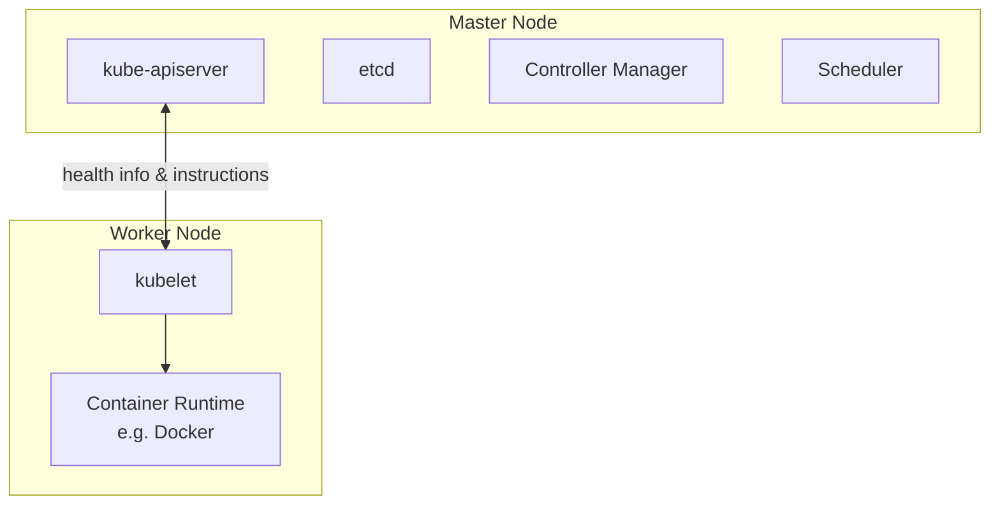
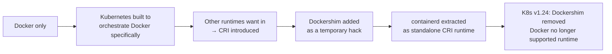
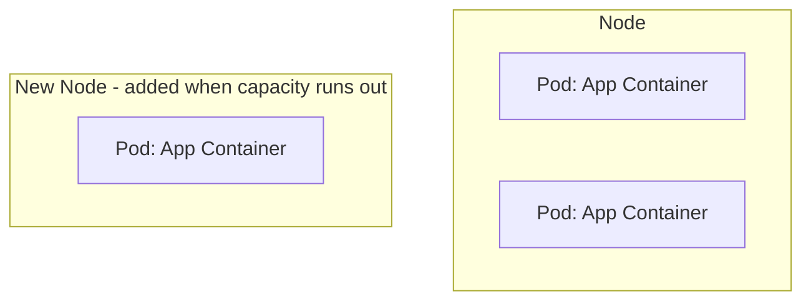
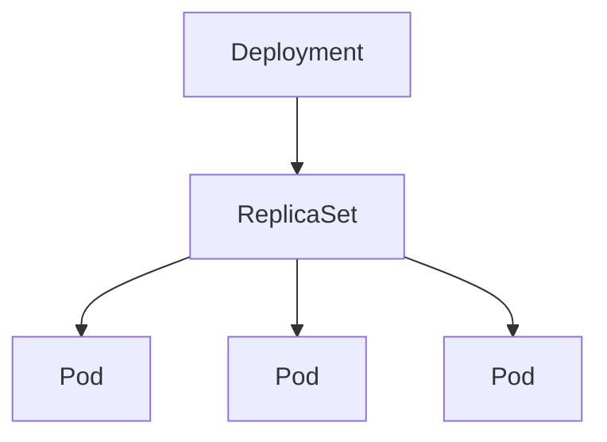

# CKAD Exam Preparation Notes

Condensed concepts from a Udemy CKAD course, for quick review before the exam.

## Table of Contents
1. [Kubernetes Basic Concepts (Nodes, Cluster, Master, Components)](#1-kubernetes-basic-concepts)
2. [Docker vs containerd (Container Runtimes & CLI Tools)](#2-docker-vs-containerd)
3. [Pods — Basic Concepts](#3-pods--basic-concepts)
4. [Pods — YAML Definition Files](#4-pods--yaml-definition-files)
5. [Replication Controllers & ReplicaSets](#5-replication-controllers--replicasets)
6. [Deployments](#6-deployments)

---

## 1. Kubernetes Basic Concepts

**Node**
- A physical or virtual machine with Kubernetes installed.
- A *worker* machine where containers are actually launched.
- Formerly called a **minion**.

**Cluster**
- A set of nodes grouped together.
- Provides fault tolerance (if one node fails, app stays accessible on others) and load sharing.

**Master**
- A node configured to manage the cluster.
- Watches over worker nodes and orchestrates containers across them.

### Core Components (installed with Kubernetes)

| Component | Role |
|---|---|
| **kube-apiserver** | Frontend for Kubernetes; all interactions (CLI, UI, tools) go through it |
| **etcd** | Distributed, reliable key-value store holding all cluster data; also handles locking to avoid conflicts between multiple masters |
| **kubelet** | Agent on each worker node; ensures containers are running as expected |
| **Container runtime** | Software that runs containers (e.g. Docker, rkt, CRI-O) |
| **Controller** | "Brain" of orchestration — detects nodes/containers/endpoints going down and decides on remediation |
| **Scheduler** | Distributes/assigns newly created containers to nodes |

### Master vs Worker Node — Component Distribution



- **Master** = has the `kube-apiserver` (this is what defines it as master), plus etcd, controller manager, scheduler.
- **Worker/Minion** = has `kubelet`, which talks to the master (reports health, executes actions) + container runtime to actually run containers.

### kubectl (Kube Control CLI)
Used to deploy/manage applications and inspect the cluster.

| Command | Purpose |
|---|---|
| `kubectl run` | Deploy an application on the cluster |
| `kubectl cluster-info` | View cluster information |
| `kubectl get nodes` | List all nodes in the cluster |

---

## 2. Docker vs containerd

### History / Timeline



- **CRI (Container Runtime Interface)**: standard interface letting any compliant runtime plug into Kubernetes.
- **OCI (Open Container Initiative)**: defines the standards CRI relies on:
  - **Image spec** – how an image should be built.
  - **Runtime spec** – how a container runtime should behave.
- Docker predates CRI, so it never natively implemented it → Kubernetes used **Dockershim** as a bridge.
- **containerd** = the container-runtime piece inside Docker (daemon that manages `runc`), spun out as its own CRI-compliant, CNCF-graduated project. Can be installed independently of Docker.
- **Docker images still work** post-Dockershim removal, because they follow the OCI image spec — only the *runtime* (Docker Engine) was dropped, not image compatibility.

### CLI Tools Comparison

| Tool | From | Works with | Purpose | Production use? |
|---|---|---|---|---|
| `docker` | Docker | Docker Engine | Full-featured CLI (build, run, volumes, network, security) | ✅ (when Docker present) |
| `ctr` | containerd community | containerd only | Debugging containerd; very limited features | ❌ Debugging only |
| `nerdctl` | containerd community | containerd only | Docker-like CLI for containerd; general purpose, supports more features than Docker (lazy pulling, encrypted images, P2P distribution, image signing, namespaces) | ✅ Recommended replacement for `docker` |
| `crictl` | Kubernetes community | Any CRI-compatible runtime (containerd, CRI-O, etc.) | Inspect/debug containers & **pods** from Kubernetes' perspective | ❌ Debugging only |

### Key Command Equivalents

| Action | Docker | nerdctl | crictl |
|---|---|---|---|
| Run container | `docker run` | `nerdctl run` | ⚠️ possible but not recommended |
| List containers | `docker ps` | `nerdctl ps` | `crictl ps` |
| Pull image | `docker pull` | `nerdctl pull` | `crictl pull` (via `ctr images pull` too) |
| Exec into container | `docker exec -it <id> <cmd>` | `nerdctl exec -it` | `crictl exec -i -t <id> <cmd>` |
| View logs | `docker logs` | `nerdctl logs` | `crictl logs` |
| List pods | N/A (Docker unaware of pods) | N/A | `crictl pods` ✅ unique |

> ⚠️ **Don't create containers with `crictl`/`ctr` in a running cluster** — kubelet doesn't know about them and will delete them, since they're outside its managed state.

### Endpoint Resolution (crictl)
Default connection attempt order: **dockershim → containerd → CRI-O → docker.sock**

Override with:
- `crictl --runtime-endpoint <endpoint>`, or
- Environment variable `CONTAINER_RUNTIME_ENDPOINT`

### Practical Takeaway
- Old labs/docs → `docker` commands.
- Modern clusters (containerd-based) → use `crictl` for troubleshooting/debugging on nodes, `nerdctl` if you need a general-purpose Docker-like CLI.

> 📌 **Note: "Docker deprecation" ≠ Docker disappearing.** Only Docker-*as-Kubernetes-runtime* was deprecated (K8s no longer needs Docker's CLI/API/build tools since containerd handles the CRI side). Docker itself is still widely used for local dev/builds. Course examples may still use `docker` commands for teaching purposes — if you only have containerd, substitute `nerdctl` in place of `docker` in most cases.

---

## 3. Pods — Basic Concepts

- Kubernetes does **not** deploy containers directly on worker nodes — containers are encapsulated inside a **Pod**.
- A **Pod** = smallest deployable object in Kubernetes = (usually) a single instance of an application.

### Pods & Scaling

- Relationship between pods and containers is typically **1:1**.
- To scale **up**: create **new pods** (not new containers inside an existing pod).
- To scale **down**: delete existing pods.
- If a node runs out of capacity, add a **new node** and schedule additional pods there.



### Multi-Container Pods

- A pod *can* contain multiple containers, but usually **not multiple copies of the same container** (that's what extra pods are for).
- Valid use case: a **helper/sidecar container** supporting the main app (e.g. processing uploaded files, fetching data).

Containers in the same pod share:
| Shared resource | Detail |
|---|---|
| **Network namespace** | Can talk to each other via `localhost` |
| **Storage/volumes** | Can share the same volume space |
| **Lifecycle ("fate")** | Created together, destroyed together |

- Kubernetes automates what you'd otherwise do manually with plain Docker: linking containers, custom networks, shared volumes, and monitoring/restarting dependent containers.
- ⚠️ **Multi-container pods are a rare use case** — course (and most real-world basic setups) sticks to **single container per pod**.

### Deploying & Inspecting Pods

| Command | Purpose |
|---|---|
| `kubectl run <name> --image=<image>` | Creates a pod and deploys a container from the given image (pulled from Docker Hub by default, or a private repo if configured) |
| `kubectl get pods` | Lists pods and their status (e.g. `ContainerCreating` → `Running`) |

- At this stage (just a pod, no Service yet), the app is only accessible **internally from the node** — external access requires Services/networking (covered later).

---

## 4. Pods — YAML Definition Files

Every Kubernetes definition file has **4 required top-level fields**:

| Field | Type | Purpose |
|---|---|---|
| `apiVersion` | string | API version used to create the object (e.g. `v1` for pods; others: `apps/v1`, `extensions/v1beta1`) |
| `kind` | string | Type of object (`Pod`, `ReplicaSet`, `Deployment`, `Service`, ...) |
| `metadata` | dictionary | Data *about* the object: `name`, `labels` (only fields Kubernetes expects — can't add arbitrary keys here) |
| `spec` | dictionary | Object-specific configuration (structure differs per `kind` — check docs) |

### YAML Structure Rules (as applied to K8s)
- `metadata.name` → string; `metadata.labels` → a nested dictionary of **arbitrary** key-value pairs (unlike `metadata` itself).
- Siblings (e.g. `name` and `labels`) must have **equal indentation**, and **more indentation than their parent** (`metadata`).
- Labels are useful for grouping/filtering objects later (e.g. `app: front-end`, `app: back-end`, `app: database`) once you have many pods.

### Pod Spec Example

```yaml
apiVersion: v1
kind: Pod
metadata:
  name: myapp-pod
  labels:
    type: front-end
    app: myapp
spec:
  containers:
    - name: nginx-container
      image: nginx
```

- `spec.containers` is a **list** (pods can hold multiple containers) — each `-` denotes a list item.
- Each list item is a dictionary with (at least) `name` and `image`.

### Commands

| Command | Purpose |
|---|---|
| `kubectl create -f pod-definition.yaml` | Create object(s) from a YAML file |
| `kubectl get pods` | List pods |
| `kubectl describe pod <name>` | Detailed info: creation time, labels, containers, associated events |
| `kubectl delete deployment <name>` | Remove a deployment (e.g. cleanup before creating a fresh pod) |

> 💡 **Editor tip**: An IDE with YAML support (e.g. PyCharm, VS Code) shows the document as a tree structure, which helps confirm indentation/hierarchy is correct — useful for catching sibling vs. child mistakes (e.g. `name`/`labels` both under `metadata`). Multiple items under `containers:` show as "item 1 of N", "item 2 of N", confirming it's parsed as a list.

### ✏️ Editing Existing Pods (exam tip)

- **If given a pod definition file**: edit the file, delete the old pod, recreate it (`kubectl delete pod <name>` → `kubectl create -f <file>`).
- **If not given a file**, extract it first:
  ```bash
  kubectl get pod <pod-name> -o yaml > pod-definition.yaml
  ```
  Then edit → delete → recreate.
- **`kubectl edit pod <pod-name>`** opens the live definition in an editor and applies changes directly — but **only these fields are editable in-place**:
  - `spec.containers[*].image`
  - `spec.initContainers[*].image`
  - `spec.activeDeadlineSeconds`
  - `spec.tolerations`
  - `spec.terminationGracePeriodSeconds`
- Anything else (e.g. changing the container's `name`, adding a container, changing ports) → **must delete & recreate** the pod, since pods are largely immutable.

---

## 5. Replication Controllers & ReplicaSets

### Why replication?
- **High availability**: if a pod crashes, a replacement is automatically created.
- **Load sharing**: multiple pods share user load; can scale across multiple nodes.
- Works even for a **single desired replica** — it still auto-recreates a failed pod.

### ReplicationController (RC) vs ReplicaSet (RS)

| | ReplicationController | ReplicaSet |
|---|---|---|
| Status | Older, legacy | Newer, **recommended** |
| `apiVersion` | `v1` | `apps/v1` |
| `selector` required? | No (defaults to pod template's labels if omitted) | **Yes** — must be explicitly defined (`matchLabels`) |
| Can manage pre-existing pods (not created by it) | Limited | Yes, via label selector matching |
| Selector matching options | Basic | More powerful (supports `matchExpressions`, etc.) |

> ⚠️ Using `v1` instead of `apps/v1` for a ReplicaSet gives: `no matches for kind "ReplicaSet"`.

### Definition File Structure

Both RC and RS nest a **pod template** inside `spec`. Structure = parent object wrapping a pod definition:

#### ReplicationController example

```yaml
apiVersion: v1
kind: ReplicationController
metadata:
  name: myapp-rc
  labels:
    app: myapp
    type: front-end
spec:
  replicas: 3
  template:
    # All Pod's metadata and spec go here
    metadata:
      labels:
        app: myapp
        type: front-end
    spec:
      containers:
        - name: nginx-container
          image: nginx
```

#### ReplicaSet example

```yaml
apiVersion: apps/v1
kind: ReplicaSet
metadata:
  name: myapp-replicaset
  labels:
    app: myapp
    type: front-end
spec:
  replicas: 3
  selector:
    matchLabels:
      type: front-end
  template:
    # All Pod's metadata and spec go here
    metadata:
      labels:
        app: myapp
        type: front-end
    spec:
      containers:
        - name: nginx-container
          image: nginx
```

### Side-by-side diff

| | ReplicationController | ReplicaSet |
|---|---|---|
| `apiVersion` | `v1` | `apps/v1` |
| `kind` | `ReplicationController` | `ReplicaSet` |
| `spec.replicas` | ✅ | ✅ |
| `spec.selector` | ❌ not required (defaults to matching `template.metadata.labels`) | ✅ **required**, written as `matchLabels` |
| `spec.template` | ✅ | ✅ |

The only structural differences are: **`apiVersion`**, **`kind`**, and the **mandatory `selector`** block in ReplicaSet. Everything else (`metadata`, `spec.replicas`, `spec.template`) is written identically.

- `spec.template` = pod definition **minus** its own `apiVersion`/`kind` (those two lines are dropped; everything else nests under `template`).
- `spec.replicas` and `spec.template` (and `spec.selector` for RS) are **siblings** — same indentation level under `spec`.
- `selector.matchLabels` **must match** the labels in `template.metadata.labels` (and/or on any existing pods you want the RS to adopt).

### Labels & Selectors — Why They Matter
- ReplicaSet is a **monitoring process**: it watches for pods matching its selector and ensures the desired count is met.
- It can **adopt pre-existing pods** that match the selector (won't create duplicates if enough already exist) — but the `template` is still required, since it's needed if a replacement pod must be created later.

### Commands

| Command | Purpose |
|---|---|
| `kubectl create -f rc-definition.yaml` | Create RC or RS from file |
| `kubectl get replicationcontroller` | List RCs |
| `kubectl get replicaset` (or `rs`) | List RSs |
| `kubectl get pods` | Pods created show a name prefixed by the RC/RS name |
| `kubectl delete replicaset <name>` | Delete RS (also deletes its pods) |
| `kubectl replace -f <file>` | Replace/update object from file |
| `kubectl apply -f <file>` | Apply updated definition file (e.g. after editing `replicas` count) |
| `kubectl scale --replicas=6 -f <file>` | Scale via CLI using file reference |
| `kubectl scale --replicas=6 replicaset <name>` | Scale via CLI using type/name (doesn't update the YAML file) |

> 📌 Scaling via `kubectl scale` does **not** update the replica count inside the definition file — the file and live cluster state can drift out of sync.

---

## 6. Deployments

### Kubernetes Object Hierarchy



- **Pod** → single instance of an application.
- **ReplicaSet** → ensures N pods are running.
- **Deployment** → sits above ReplicaSet; provides production-grade capabilities:
  - **Rolling updates** — upgrade instances one at a time (not all at once), avoiding user impact.
  - **Rollback** — undo a problematic update.
  - **Pause & Resume** — batch multiple changes (e.g. image upgrade + scaling + resource limits) and apply them together as one rollout instead of one-by-one.

### Definition File

Nearly identical to a ReplicaSet definition — only `kind` differs:

```yaml
apiVersion: apps/v1
kind: Deployment
metadata:
  name: myapp-deployment
  labels:
    app: myapp
    type: front-end
spec:
  replicas: 3
  selector:
    matchLabels:
      type: front-end
  template:
    metadata:
      labels:
        app: myapp
        type: front-end
    spec:
      containers:
        - name: nginx-container
          image: nginx
```

### What Happens on Creation
`kubectl create -f deployment-definition.yaml` →
1. Creates a **Deployment**
2. Which automatically creates a **ReplicaSet** (named after the deployment)
3. Which automatically creates **Pods** (named after the deployment + replica set)

### Commands

| Command | Purpose |
|---|---|
| `kubectl create -f deployment-definition.yaml` | Create a deployment |
| `kubectl get deployments` | List deployments |
| `kubectl get replicaset` | See the auto-created ReplicaSet |
| `kubectl get pods` | See the auto-created Pods |
| `kubectl get all` | See all created objects (Deployment → ReplicaSet → Pods) at once |

> At this stage, Deployment behaves just like a ReplicaSet — the real value (rolling updates, rollback, pause/resume) is covered in upcoming lectures.

---