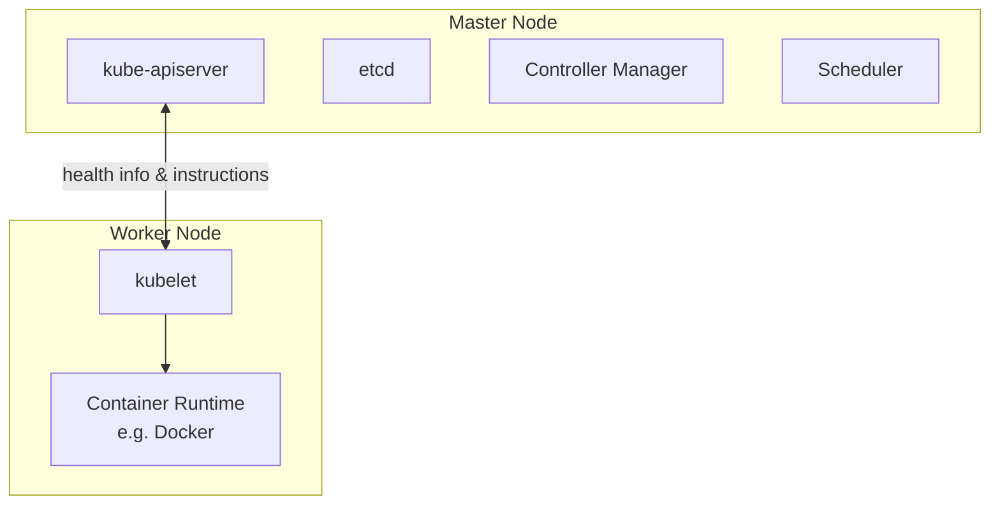
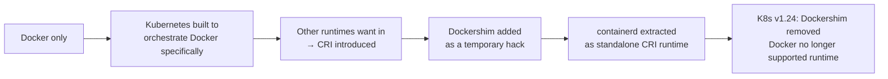
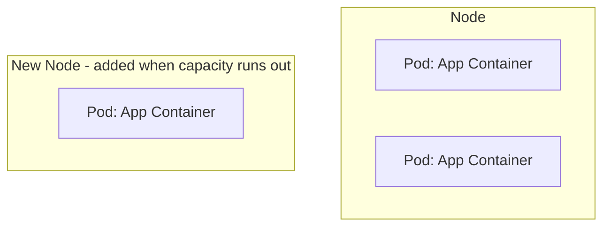
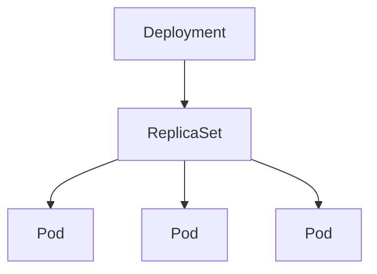
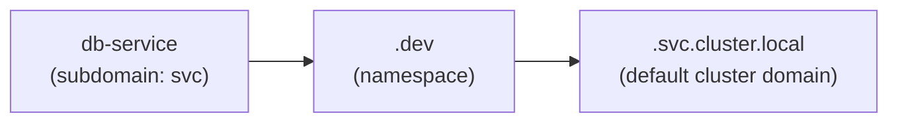
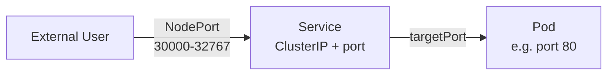
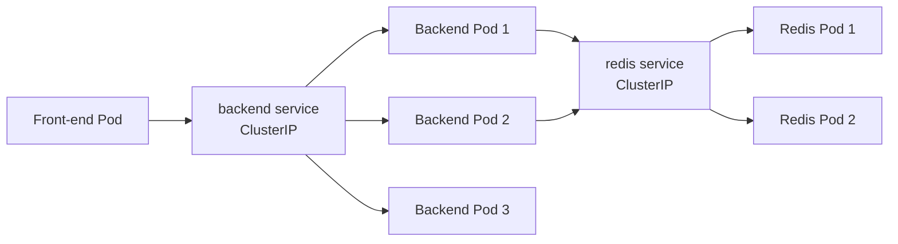

# CKAD Exam Preparation Notes

Condensed concepts from a Udemy CKAD course, for quick review before the exam.

## Table of Contents
1. [Kubernetes Basic Concepts (Nodes, Cluster, Master, Components)](#1-kubernetes-basic-concepts)
2. [Docker vs containerd (Container Runtimes & CLI Tools)](#2-docker-vs-containerd)
3. [Pods — Basic Concepts](#3-pods--basic-concepts)
4. [Pods — YAML Definition Files](#4-pods--yaml-definition-files)
5. [Replication Controllers & ReplicaSets](#5-replication-controllers--replicasets)
6. [Deployments](#6-deployments)
7. [Namespaces](#7-namespaces)
8. [Services — NodePort](#8-services--nodeport)
9. [Services — ClusterIP](#9-services--clusterip)
10. [Imperative Commands (Exam Tip)](#10-imperative-commands-exam-tip)
11. [kubectl explain & api-resources](#11-kubectl-explain--api-resources)
12. [Docker Images & Dockerfile](#12-docker-images--dockerfile)
13. [Docker Commands, Arguments & Entrypoint](#13-docker-commands-arguments--entrypoint)

---

## 1. Kubernetes Basic Concepts

**Node**
- A physical or virtual machine with Kubernetes installed.
- A *worker* machine where containers are actually launched.
- Formerly called a **minion**.

**Cluster**
- A set of nodes grouped together.
- Provides fault tolerance (if one node fails, app stays accessible on others) and load sharing.

**Master**
- A node configured to manage the cluster.
- Watches over worker nodes and orchestrates containers across them.

### Core Components (installed with Kubernetes)

| Component | Role |
|---|---|
| **kube-apiserver** | Frontend for Kubernetes; all interactions (CLI, UI, tools) go through it |
| **etcd** | Distributed, reliable key-value store holding all cluster data; also handles locking to avoid conflicts between multiple masters |
| **kubelet** | Agent on each worker node; ensures containers are running as expected |
| **Container runtime** | Software that runs containers (e.g. Docker, rkt, CRI-O) |
| **Controller** | "Brain" of orchestration — detects nodes/containers/endpoints going down and decides on remediation |
| **Scheduler** | Distributes/assigns newly created containers to nodes |

### Master vs Worker Node — Component Distribution



- **Master** = has the `kube-apiserver` (this is what defines it as master), plus etcd, controller manager, scheduler.
- **Worker/Minion** = has `kubelet`, which talks to the master (reports health, executes actions) + container runtime to actually run containers.

### kubectl (Kube Control CLI)
Used to deploy/manage applications and inspect the cluster.

| Command | Purpose |
|---|---|
| `kubectl run` | Deploy an application on the cluster |
| `kubectl cluster-info` | View cluster information |
| `kubectl get nodes` | List all nodes in the cluster |

---

## 2. Docker vs containerd

### History / Timeline



- **CRI (Container Runtime Interface)**: standard interface letting any compliant runtime plug into Kubernetes.
- **OCI (Open Container Initiative)**: defines the standards CRI relies on:
  - **Image spec** – how an image should be built.
  - **Runtime spec** – how a container runtime should behave.
- Docker predates CRI, so it never natively implemented it → Kubernetes used **Dockershim** as a bridge.
- **containerd** = the container-runtime piece inside Docker (daemon that manages `runc`), spun out as its own CRI-compliant, CNCF-graduated project. Can be installed independently of Docker.
- **Docker images still work** post-Dockershim removal, because they follow the OCI image spec — only the *runtime* (Docker Engine) was dropped, not image compatibility.

### CLI Tools Comparison

| Tool | From | Works with | Purpose | Production use? |
|---|---|---|---|---|
| `docker` | Docker | Docker Engine | Full-featured CLI (build, run, volumes, network, security) | ✅ (when Docker present) |
| `ctr` | containerd community | containerd only | Debugging containerd; very limited features | ❌ Debugging only |
| `nerdctl` | containerd community | containerd only | Docker-like CLI for containerd; general purpose, supports more features than Docker (lazy pulling, encrypted images, P2P distribution, image signing, namespaces) | ✅ Recommended replacement for `docker` |
| `crictl` | Kubernetes community | Any CRI-compatible runtime (containerd, CRI-O, etc.) | Inspect/debug containers & **pods** from Kubernetes' perspective | ❌ Debugging only |

### Key Command Equivalents

| Action | Docker | nerdctl | crictl |
|---|---|---|---|
| Run container | `docker run` | `nerdctl run` | ⚠️ possible but not recommended |
| List containers | `docker ps` | `nerdctl ps` | `crictl ps` |
| Pull image | `docker pull` | `nerdctl pull` | `crictl pull` (via `ctr images pull` too) |
| Exec into container | `docker exec -it <id> <cmd>` | `nerdctl exec -it` | `crictl exec -i -t <id> <cmd>` |
| View logs | `docker logs` | `nerdctl logs` | `crictl logs` |
| List pods | N/A (Docker unaware of pods) | N/A | `crictl pods` ✅ unique |

> ⚠️ **Don't create containers with `crictl`/`ctr` in a running cluster** — kubelet doesn't know about them and will delete them, since they're outside its managed state.

### Endpoint Resolution (crictl)
Default connection attempt order: **dockershim → containerd → CRI-O → docker.sock**

Override with:
- `crictl --runtime-endpoint <endpoint>`, or
- Environment variable `CONTAINER_RUNTIME_ENDPOINT`

### Practical Takeaway
- Old labs/docs → `docker` commands.
- Modern clusters (containerd-based) → use `crictl` for troubleshooting/debugging on nodes, `nerdctl` if you need a general-purpose Docker-like CLI.

> 📌 **Note: "Docker deprecation" ≠ Docker disappearing.** Only Docker-*as-Kubernetes-runtime* was deprecated (K8s no longer needs Docker's CLI/API/build tools since containerd handles the CRI side). Docker itself is still widely used for local dev/builds. Course examples may still use `docker` commands for teaching purposes — if you only have containerd, substitute `nerdctl` in place of `docker` in most cases.

---

## 3. Pods — Basic Concepts

- Kubernetes does **not** deploy containers directly on worker nodes — containers are encapsulated inside a **Pod**.
- A **Pod** = smallest deployable object in Kubernetes = (usually) a single instance of an application.

### Pods & Scaling

- Relationship between pods and containers is typically **1:1**.
- To scale **up**: create **new pods** (not new containers inside an existing pod).
- To scale **down**: delete existing pods.
- If a node runs out of capacity, add a **new node** and schedule additional pods there.



### Multi-Container Pods

- A pod *can* contain multiple containers, but usually **not multiple copies of the same container** (that's what extra pods are for).
- Valid use case: a **helper/sidecar container** supporting the main app (e.g. processing uploaded files, fetching data).

Containers in the same pod share:
| Shared resource | Detail |
|---|---|
| **Network namespace** | Can talk to each other via `localhost` |
| **Storage/volumes** | Can share the same volume space |
| **Lifecycle ("fate")** | Created together, destroyed together |

- Kubernetes automates what you'd otherwise do manually with plain Docker: linking containers, custom networks, shared volumes, and monitoring/restarting dependent containers.
- ⚠️ **Multi-container pods are a rare use case** — course (and most real-world basic setups) sticks to **single container per pod**.

### Deploying & Inspecting Pods

| Command | Purpose |
|---|---|
| `kubectl run <name> --image=<image>` | Creates a pod and deploys a container from the given image (pulled from Docker Hub by default, or a private repo if configured) |
| `kubectl get pods` | Lists pods and their status (e.g. `ContainerCreating` → `Running`) |

- At this stage (just a pod, no Service yet), the app is only accessible **internally from the node** — external access requires Services/networking (covered later).

---

## 4. Pods — YAML Definition Files

Every Kubernetes definition file has **4 required top-level fields**:

| Field | Type | Purpose |
|---|---|---|
| `apiVersion` | string | API version used to create the object (e.g. `v1` for pods; others: `apps/v1`, `extensions/v1beta1`) |
| `kind` | string | Type of object (`Pod`, `ReplicaSet`, `Deployment`, `Service`, ...) |
| `metadata` | dictionary | Data *about* the object: `name`, `labels` (only fields Kubernetes expects — can't add arbitrary keys here) |
| `spec` | dictionary | Object-specific configuration (structure differs per `kind` — check docs) |

### YAML Structure Rules (as applied to K8s)
- `metadata.name` → string; `metadata.labels` → a nested dictionary of **arbitrary** key-value pairs (unlike `metadata` itself).
- Siblings (e.g. `name` and `labels`) must have **equal indentation**, and **more indentation than their parent** (`metadata`).
- Labels are useful for grouping/filtering objects later (e.g. `app: front-end`, `app: back-end`, `app: database`) once you have many pods.

### Pod Spec Example

```yaml
apiVersion: v1
kind: Pod
metadata:
  name: myapp-pod
  labels:
    type: front-end
    app: myapp
spec:
  containers:
    - name: nginx-container
      image: nginx
      ports:
        - containerPort: 8080
```

- `spec.containers` is a **list** (pods can hold multiple containers) — each `-` denotes a list item.
- Each list item is a dictionary with (at least) `name` and `image`.
- `ports` (optional) declares the port(s) the container listens on — informational/documentation purposes; it doesn't by itself expose the port outside the pod (that's what a Service is for).

### Commands

| Command | Purpose |
|---|---|
| `kubectl create -f pod-definition.yaml` | Create object(s) from a YAML file |
| `kubectl get pods` | List pods |
| `kubectl get pods -o wide` | List pods with extra details (Node, IP, etc.) |
| `kubectl describe pod <name>` | Detailed info: creation time, labels, containers, associated events |
| `kubectl delete deployment <name>` | Remove a deployment (e.g. cleanup before creating a fresh pod) |

> 💡 **Editor tip**: An IDE with YAML support (e.g. PyCharm, VS Code) shows the document as a tree structure, which helps confirm indentation/hierarchy is correct — useful for catching sibling vs. child mistakes (e.g. `name`/`labels` both under `metadata`). Multiple items under `containers:` show as "item 1 of N", "item 2 of N", confirming it's parsed as a list.

### ✏️ Editing Existing Pods (exam tip)

- **If given a pod definition file**: edit the file, delete the old pod, recreate it (`kubectl delete pod <name>` → `kubectl create -f <file>`).
- **If not given a file**, extract it first:
  ```bash
  kubectl get pod <pod-name> -o yaml > pod-definition.yaml
  ```
  Then edit → delete → recreate.
- **`kubectl edit pod <pod-name>`** opens the live definition in an editor and applies changes directly — but **only these fields are editable in-place**:
  - `spec.containers[*].image`
  - `spec.initContainers[*].image`
  - `spec.activeDeadlineSeconds`
  - `spec.tolerations`
  - `spec.terminationGracePeriodSeconds`
- Anything else (e.g. changing the container's `name`, adding a container, changing ports) → **must delete & recreate** the pod, since pods are largely immutable.

---

## 5. Replication Controllers & ReplicaSets

### Why replication?
- **High availability**: if a pod crashes, a replacement is automatically created.
- **Load sharing**: multiple pods share user load; can scale across multiple nodes.
- Works even for a **single desired replica** — it still auto-recreates a failed pod.

### ReplicationController (RC) vs ReplicaSet (RS)

| | ReplicationController | ReplicaSet |
|---|---|---|
| Status | Older, legacy | Newer, **recommended** |
| `apiVersion` | `v1` | `apps/v1` |
| `selector` required? | No (defaults to pod template's labels if omitted) | **Yes** — must be explicitly defined (`matchLabels`) |
| Can manage pre-existing pods (not created by it) | Limited | Yes, via label selector matching |
| Selector matching options | Basic | More powerful (supports `matchExpressions`, etc.) |

> ⚠️ Using `v1` instead of `apps/v1` for a ReplicaSet gives: `no matches for kind "ReplicaSet"`.

### Definition File Structure

Both RC and RS nest a **pod template** inside `spec`. Structure = parent object wrapping a pod definition:

#### ReplicationController example

```yaml
apiVersion: v1
kind: ReplicationController
metadata:
  name: myapp-rc
  labels:
    app: myapp
    type: front-end
spec:
  replicas: 3
  template:
    # All Pod's metadata and spec go here
    metadata:
      labels:
        app: myapp
        type: front-end
    spec:
      containers:
        - name: nginx-container
          image: nginx
```

#### ReplicaSet example

```yaml
apiVersion: apps/v1
kind: ReplicaSet
metadata:
  name: myapp-replicaset
  labels:
    app: myapp
    type: front-end
spec:
  replicas: 3
  selector:
    matchLabels:
      type: front-end
  template:
    # All Pod's metadata and spec go here
    metadata:
      labels:
        app: myapp
        type: front-end
    spec:
      containers:
        - name: nginx-container
          image: nginx
```

### Side-by-side diff

| | ReplicationController | ReplicaSet |
|---|---|---|
| `apiVersion` | `v1` | `apps/v1` |
| `kind` | `ReplicationController` | `ReplicaSet` |
| `spec.replicas` | ✅ | ✅ |
| `spec.selector` | ❌ not required (defaults to matching `template.metadata.labels`) | ✅ **required**, written as `matchLabels` |
| `spec.template` | ✅ | ✅ |

The only structural differences are: **`apiVersion`**, **`kind`**, and the **mandatory `selector`** block in ReplicaSet. Everything else (`metadata`, `spec.replicas`, `spec.template`) is written identically.

- `spec.template` = pod definition **minus** its own `apiVersion`/`kind` (those two lines are dropped; everything else nests under `template`).
- `spec.replicas` and `spec.template` (and `spec.selector` for RS) are **siblings** — same indentation level under `spec`.
- `selector.matchLabels` **must match** the labels in `template.metadata.labels` (and/or on any existing pods you want the RS to adopt).

### Labels & Selectors — Why They Matter
- ReplicaSet is a **monitoring process**: it watches for pods matching its selector and ensures the desired count is met.
- It can **adopt pre-existing pods** that match the selector (won't create duplicates if enough already exist) — but the `template` is still required, since it's needed if a replacement pod must be created later.

### Commands

| Command | Purpose |
|---|---|
| `kubectl create -f rc-definition.yaml` | Create RC or RS from file |
| `kubectl get replicationcontroller` | List RCs |
| `kubectl get replicaset` (or `rs`) | List RSs |
| `kubectl get pods` | Pods created show a name prefixed by the RC/RS name |
| `kubectl delete replicaset <name>` | Delete RS (also deletes its pods) |
| `kubectl replace -f <file>` | Replace/update object from file |
| `kubectl apply -f <file>` | Apply updated definition file (e.g. after editing `replicas` count) |
| `kubectl scale --replicas=6 -f <file>` | Scale via CLI using file reference |
| `kubectl scale --replicas=6 replicaset <name>` | Scale via CLI using type/name (doesn't update the YAML file) |

> 📌 Scaling via `kubectl scale` does **not** update the replica count inside the definition file — the file and live cluster state can drift out of sync.

---

## 6. Deployments

### Kubernetes Object Hierarchy



- **Pod** → single instance of an application.
- **ReplicaSet** → ensures N pods are running.
- **Deployment** → sits above ReplicaSet; provides production-grade capabilities:
  - **Rolling updates** — upgrade instances one at a time (not all at once), avoiding user impact.
  - **Rollback** — undo a problematic update.
  - **Pause & Resume** — batch multiple changes (e.g. image upgrade + scaling + resource limits) and apply them together as one rollout instead of one-by-one.

### Definition File

Nearly identical to a ReplicaSet definition — only `kind` differs:

```yaml
apiVersion: apps/v1
kind: Deployment
metadata:
  name: myapp-deployment
  labels:
    app: myapp
    type: front-end
spec:
  replicas: 3
  selector:
    matchLabels:
      type: front-end
  template:
    metadata:
      labels:
        app: myapp
        type: front-end
    spec:
      containers:
        - name: nginx-container
          image: nginx
```

### What Happens on Creation
`kubectl create -f deployment-definition.yaml` →
1. Creates a **Deployment**
2. Which automatically creates a **ReplicaSet** (named after the deployment)
3. Which automatically creates **Pods** (named after the deployment + replica set)

### Commands

| Command | Purpose |
|---|---|
| `kubectl create -f deployment-definition.yaml` | Create a deployment |
| `kubectl get deployments` | List deployments |
| `kubectl get replicaset` | See the auto-created ReplicaSet |
| `kubectl get pods` | See the auto-created Pods |
| `kubectl get all` | See all created objects (Deployment → ReplicaSet → Pods) at once |

> At this stage, Deployment behaves just like a ReplicaSet — the real value (rolling updates, rollback, pause/resume) is covered in upcoming lectures.

---

## 7. Namespaces

**Analogy**: Two people named "Mark" in different houses (Smiths, Williams) go by first name *within* their house, but need the full name (Mark Smith) when referenced from outside or across houses. Houses = namespaces; each has its own rules and resources.

### Default Namespaces (auto-created by Kubernetes)

| Namespace | Purpose |
|---|---|
| `default` | Where your objects go if you don't specify a namespace |
| `kube-system` | Internal Kubernetes pods/services (networking, DNS, etc.) — isolated to avoid accidental changes |
| `kube-public` | Resources meant to be accessible to **all** users across all namespaces |

### Why Use Namespaces
- Isolate resources between environments (e.g. `dev` vs `prod`) on the **same cluster**.
- Prevent accidental cross-environment changes.
- Apply namespace-specific **policies** and **resource quotas** (limit CPU/memory/pod count per namespace).

### Cross-Namespace Communication (DNS)

- Within the **same** namespace: reference a service simply by its name → `db-service`
- Across namespaces: `<service-name>.<namespace>.svc.cluster.local`
  - e.g. `db-service.dev.svc.cluster.local`


Breakdown: `<service>.<namespace>.svc.cluster.local` — `cluster.local` = default cluster domain, `svc` = subdomain for services.

### Commands

| Command | Purpose |
|---|---|
| `kubectl get pods` | Lists pods in `default` namespace only |
| `kubectl get pods --namespace=kube-system` | List pods in a specific namespace |
| `kubectl create -f pod-definition.yaml --namespace=dev` | Create a pod in a specific namespace (CLI override) |
| `kubectl create namespace dev` | Create a namespace directly via CLI |
| `kubectl get pods --all-namespaces` (or `-A`) | List pods across **all** namespaces |
| `kubectl config current-context` | Show which context is currently active |
| `kubectl config set-context --current --namespace=dev` | Same as above, using `--current` instead of naming the context explicitly |
| `kubectl config set-context --current -n dev` | Same as above, using the short flag `-n` (note: no `=` with short flags) |
| `kubectl config set-context $(kubectl config current-context) --namespace=dev` | Permanently switch the **current context** to a namespace (no need to pass `--namespace` each time) |
| `kubectl config get-contexts` | List all contexts and see which one is currently active |

To permanently bind a pod to a namespace in its YAML (instead of passing `--namespace` every time):
```yaml
apiVersion: v1
kind: Pod
metadata:
  name: myapp-pod
  namespace: dev
  labels:
    app: myapp
spec:
  containers:
    - name: nginx-container
      image: nginx
```

### Creating a Namespace via Definition File

```yaml
apiVersion: v1
kind: Namespace
metadata:
  name: dev
```
`kubectl create -f namespace-dev.yaml`

### Resource Quotas (limit usage per namespace)

```yaml
apiVersion: v1
kind: ResourceQuota
metadata:
  name: compute-quota
  namespace: dev
spec:
  hard:
    pods: "10"
    requests.cpu: "4"
    requests.memory: 5Gi
    limits.cpu: "10"
    limits.memory: 10Gi
```

> 📌 Contexts (used to manage multiple clusters/environments from one `kubectl` setup) are a related but separate topic — covered elsewhere.

---

## 8. Services — NodePort

### Purpose
A **Service** enables communication between pods, and between pods and the outside world (loose coupling between microservices). It's a Kubernetes object like Pods/ReplicaSets/Deployments.

### The Networking Problem
- Each **node** has its own IP (e.g. `192.168.1.2`), on the same network as your laptop.
- Each **pod** has an IP in a separate internal pod network (e.g. `10.244.0.2`) — **not directly reachable** from outside the cluster/node.
- SSH-ing into the node and curling the pod IP works, but isn't practical for external users.
- **Solution**: a **Service** sits in the middle and forwards traffic from an externally-reachable node port → to the pod.

### Service Types

| Type | Behavior |
|---|---|
| **NodePort** | Exposes the service on a static port on every node's IP; external traffic → node port → service → pod |
| **ClusterIP** | Creates a virtual internal IP for service-to-service communication (e.g. front-end → back-end) — default type |
| **LoadBalancer** | Provisions an external load balancer (on supported cloud providers) — e.g. to distribute traffic across front-end web servers |

### NodePort — Three Ports Involved



| Port | Meaning | Constraint |
|---|---|---|
| `targetPort` | Port the app/container listens on inside the pod | Defaults to `port` if omitted |
| `port` | Port on the Service itself (its virtual IP) | **Only mandatory field** |
| `nodePort` | Port exposed on the node's IP for external access | Valid range: **30000–32767**; auto-assigned from that range if omitted |

### Definition File

```yaml
apiVersion: v1
kind: Service
metadata:
  name: myapp-service
spec:
  type: NodePort
  ports:
    - targetPort: 80
      port: 80
      nodePort: 30008    # Range 30000-32767
  selector:
    # Put metadata.labels of Pod here
    app: myapp
    type: front-end
```

- `spec.ports` is a **list** (a service can expose multiple port mappings).
- `spec.selector` links the service to pod(s) — must **match the labels** on the target pod(s) (same labels/selector mechanism as ReplicaSets/Deployments). Without this, the Service has no way to know which pods to forward to.

### Commands

| Command | Purpose |
|---|---|
| `kubectl create -f service-definition.yaml` | Create the service |
| `kubectl get services` (or `svc`) | List services, their ClusterIP, and mapped ports |
| `curl http://<node-ip>:<nodePort>` | Access the app externally |

### Multi-Pod & Multi-Node Behavior (automatic — no extra config needed)

- **Multiple pods, same node**: if several pods share the label matched by the selector, the Service automatically load-balances across all of them using a **random algorithm** (built-in load balancing).
- **Multiple pods across multiple nodes**: Kubernetes automatically maps the **same nodePort** on **every node** in the cluster — so the app is reachable via *any* node's IP + that port, regardless of which node actually hosts the pod.
- Service endpoints update automatically as pods are added/removed (no manual reconfiguration needed).

---

## 9. Services — ClusterIP

### The Problem
A full-stack app typically has multiple tiers: front-end, back-end, cache (Redis), database (MySQL). These tiers need to talk to each other, but:
- Pod IPs are **ephemeral** — pods die/restart, IPs change constantly.
- With multiple pods per tier, **which one** should another pod connect to, and who decides?

### The Solution: ClusterIP
A **ClusterIP** service groups a set of pods (e.g. all backend pods) and exposes **one stable internal IP + DNS name** as the single access point. Requests to the service are forwarded to one of the grouped pods (**randomly**).



- Enables clean microservices architecture: each tier can scale, move, or be replaced without breaking communication — other pods only ever talk to the **service name**, never pod IPs directly.
- **ClusterIP is the default service type** — if `type` is omitted, it defaults to ClusterIP.

### Definition File

```yaml
apiVersion: v1
kind: Service
metadata:
  name: back-end
spec:
  type: ClusterIP     # default type, can be omitted
  ports:
    - targetPort: 80
      port: 80
  selector:
    # Put metadata.labels of Pod here
    app: myapp
    type: back-end
```

- `targetPort` = port the backend pods expose; `port` = port on the service itself.
- `selector` links the service to pods, same pattern as NodePort — copy the labels from the target pod definition.

### Commands

| Command | Purpose |
|---|---|
| `kubectl create -f service-definition.yaml` | Create the service |
| `kubectl get services` (or `svc`) | Check status, ClusterIP, ports |

- Other pods reach it via the **service name** (DNS) or its **ClusterIP** — never via individual pod IPs.

---

## 10. Imperative Commands (Exam Tip) ⭐

Declarative (YAML files) is the standard approach, but **imperative commands save major time** on the exam — both for quick one-off tasks and for generating a YAML template to then edit.

### Key Flags

| Flag | Purpose |
|---|---|
| `--dry-run=client` | Doesn't actually create the resource — just validates the command |
| `-o yaml` | Outputs the resource definition as YAML instead of creating it |
| Combined + `>` redirect | Generates a YAML file to edit, instead of writing one from scratch |

```bash
kubectl run nginx --image=nginx --dry-run=client -o yaml > nginx-pod.yaml
```

### Pod

| Task | Command |
|---|---|
| Create an nginx pod | `kubectl run nginx --image=nginx` |
| Generate pod YAML only (no creation) | `kubectl run nginx --image=nginx --dry-run=client -o yaml` |

### Deployment

| Task | Command |
|---|---|
| Create a deployment | `kubectl create deployment nginx --image=nginx` |
| Generate deployment YAML only | `kubectl create deployment nginx --image=nginx --dry-run=client -o yaml` |
| Create with 4 replicas directly | `kubectl create deployment nginx --image=nginx --replicas=4` |
| Scale an existing deployment | `kubectl scale deployment nginx --replicas=4` |
| Generate YAML to file, then edit before creating | `kubectl create deployment nginx --image=nginx --dry-run=client -o yaml > nginx-deployment.yaml` |

### Service

**ClusterIP** — expose pod `redis` on port 6379 as `redis-service`:
```bash
kubectl expose pod redis --port=6379 --name redis-service --dry-run=client -o yaml
```
- ✅ Automatically uses the **pod's actual labels** as selectors.

Alternative:
```bash
kubectl create service clusterip redis --tcp=6379:6379 --dry-run=client -o yaml
```
- ⚠️ Does **not** use the pod's labels — assumes selector `app=redis` and you **cannot pass in custom selectors** via CLI. Only safe if your pod's label happens to match; otherwise generate the file and edit the selector manually.

**NodePort** — expose pod `nginx` port 80 as `nginx-service`, nodePort 30080:
```bash
kubectl expose pod nginx --port=80 --name nginx-service --type=NodePort --dry-run=client -o yaml
```
- ✅ Uses pod's labels as selectors, but ⚠️ **cannot specify the nodePort** via this command — must generate the file and manually add `nodePort: 30080` before creating.

Alternative:
```bash
kubectl create service nodeport nginx --tcp=80:80 --node-port=30080 --dry-run=client -o yaml
```
- ✅ Can specify nodePort, but ⚠️ does **not** use the pod's labels as selectors.

> 💡 **Recommendation**: prefer `kubectl expose` (keeps correct selectors). If you need a specific `nodePort`, generate the YAML with `expose` + `--dry-run=client -o yaml`, then manually add the `nodePort` field before applying.

### Output Formatting (`-o`)

```
kubectl [command] [TYPE] [NAME] -o <output_format>
```

| Format | Result |
|---|---|
| `-o json` | Full resource as JSON |
| `-o yaml` | Full resource as YAML |
| `-o name` | Just the resource name |
| `-o wide` | Plain-text table + extra columns (e.g. IP, Node) |

```bash
kubectl get pods -o wide
# NAME      READY   STATUS    RESTARTS   AGE     IP          NODE     ...
```

> Combine with `--dry-run=client` to preview a resource's YAML/JSON without creating it (see examples above).

---

## 11. kubectl explain & api-resources ⭐

Useful for exploring resources and fields **without leaving the terminal / docs**.

| Command | Purpose |
|---|---|
| `kubectl api-resources` | List **all** resource types: their name, short name, API group/version, whether namespaced. Great when you forget a resource's exact name, short name, or correct casing |
| `kubectl explain pod` | Shows **top-level** fields of a resource (`apiVersion`, `kind`, `metadata`, `spec`, `status`) with type + description |
| `kubectl explain pod.spec` | Drills into a specific field's **subfields** (still only one level deep at a time) |
| `kubectl explain pod --recursive` | Outputs the **entire nested field structure** at once — the fastest way to see everything available for a YAML file |

> 💡 Use `api-resources` to find the resource name → `explain <resource> --recursive` to see the full field tree → build your YAML confidently without needing the docs website.

---

## 12. Docker Images & Dockerfile

### Why Build Your Own Image
- No suitable image exists on Docker Hub for what you need, or
- You want to Dockerize your own application for easier shipping/deployment.

### Workflow


### Dockerfile Format
Instruction (CAPS) + argument, one per line:

```dockerfile
FROM Ubuntu

RUN apt-get update
RUN apt-get install python

RUN pip install flask
RUN pip install flask-mysql

COPY . /opt/source-code

ENTRYPOINT FLASK_APP=/opt/source-code/app.py flask run
```

| Instruction | Purpose |
|---|---|
| `FROM` | **Required as the first line** — defines the base image/OS (every image must be based on another image, ultimately an OS) |
| `RUN` | Executes a command while building the image (e.g. install packages) |
| `COPY` | Copies files from local system into the image |
| `ENTRYPOINT` | Command executed when a container is run from this image |

### Layered Architecture
- Each instruction/line creates a **new layer**, storing only the **diff** from the previous layer.
- Layers are **cached** by Docker:
  - If a build step fails, fixing it and rebuilding **reuses cached layers** up to that point instead of starting over.
  - If you add new instructions, only layers **from that point onward** need rebuilding — faster iteration, especially when just updating app source code (put frequently-changing steps, like `COPY` of source code, later in the file).
- `docker history <image>` shows each layer and its size contribution.

### Commands

| Command | Purpose |
|---|---|
| `docker build -t <account>/<image-name> .` | Build image from Dockerfile in current directory |
| `docker push <account>/<image-name>` | Publish image to Docker Hub |
| `docker history <image-name>` | Show layers and their sizes |

> 📌 Almost anything can be containerized — not just servers/databases, but dev tools, browsers, utilities, even desktop apps.

---

## 13. Docker Commands, Arguments & Entrypoint

> Not strictly in the CKAD curriculum, but foundational for understanding Pod `command`/`args` (next section).

### Why Containers Exit
- Containers are **not** VMs — they don't host a full OS, they run **one process/task**.
- A container's lifetime = its main process's lifetime. When that process ends (or crashes), the container exits.
- `docker run ubuntu` exits almost immediately because the Ubuntu image's default command is `bash` — a shell that needs a terminal; with no terminal attached, it exits instantly → container exits too.

### CMD vs ENTRYPOINT

| Instruction | Role | Behavior when you pass args to `docker run` |
|---|---|---|
| `CMD` | Default command **and/or default args** | Fully **replaced** by whatever you pass on the command line |
| `ENTRYPOINT` | The fixed **executable** to run | Whatever you pass gets **appended** to it |

```dockerfile
# CMD only
FROM ubuntu
CMD ["sleep", "5"]
```
`docker run ubuntu-sleeper 10` → runs `sleep 10` (CMD fully overridden)

```dockerfile
# ENTRYPOINT only
FROM ubuntu
ENTRYPOINT ["sleep"]
```
`docker run ubuntu-sleeper 10` → runs `sleep 10` (10 appended to entrypoint)
`docker run ubuntu-sleeper` (no args) → runs just `sleep` → **error: operand missing**

```dockerfile
# ENTRYPOINT + CMD combined (best of both — default value with override capability)
FROM ubuntu
ENTRYPOINT ["sleep"]
CMD ["5"]
```
- No args passed → `CMD` value used as default arg → `sleep 5`
- Args passed (`docker run ubuntu-sleeper 10`) → overrides `CMD`, appended to `ENTRYPOINT` → `sleep 10`

> ⚠️ Both `ENTRYPOINT` and `CMD` should be written in **JSON array format**, with the executable as the **first element**, for this combination to work correctly:
> ✅ `["sleep", "5"]` — correct
> ❌ `["sleep 5"]` — wrong (command+params as one string)

### Runtime Overrides

| Goal | How |
|---|---|
| One-off override of `CMD` | Append a command to `docker run <image> <new-command>` |
| Permanently change default command | Build a new image with a modified `CMD`/`ENTRYPOINT` |
| Override `ENTRYPOINT` itself at runtime | `docker run --entrypoint <new-entrypoint> <image> <args>` |

---