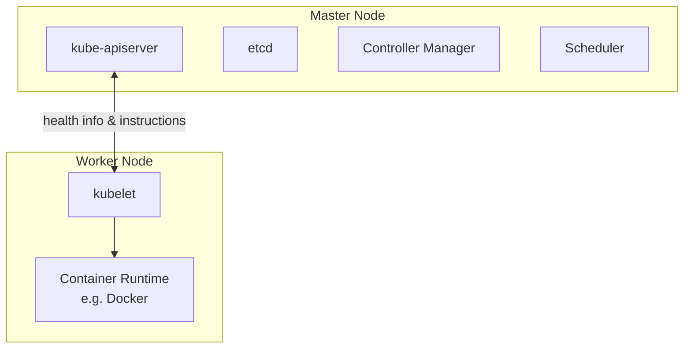
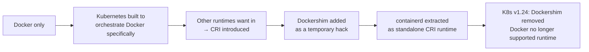
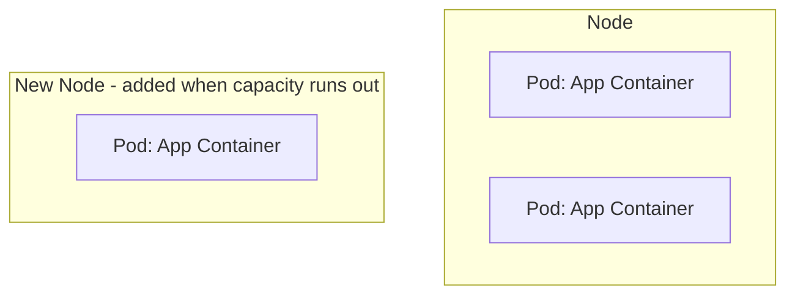

# CKAD Exam Preparation Notes

Condensed concepts from a Udemy CKAD course, for quick review before the exam.

## Table of Contents
1. [Kubernetes Basic Concepts (Nodes, Cluster, Master, Components)](#1-kubernetes-basic-concepts)
2. [Docker vs containerd (Container Runtimes & CLI Tools)](#2-docker-vs-containerd)
3. [Pods — Basic Concepts](#3-pods--basic-concepts)

---

## 1. Kubernetes Basic Concepts

**Node**
- A physical or virtual machine with Kubernetes installed.
- A *worker* machine where containers are actually launched.
- Formerly called a **minion**.

**Cluster**
- A set of nodes grouped together.
- Provides fault tolerance (if one node fails, app stays accessible on others) and load sharing.

**Master**
- A node configured to manage the cluster.
- Watches over worker nodes and orchestrates containers across them.

### Core Components (installed with Kubernetes)

| Component | Role |
|---|---|
| **kube-apiserver** | Frontend for Kubernetes; all interactions (CLI, UI, tools) go through it |
| **etcd** | Distributed, reliable key-value store holding all cluster data; also handles locking to avoid conflicts between multiple masters |
| **kubelet** | Agent on each worker node; ensures containers are running as expected |
| **Container runtime** | Software that runs containers (e.g. Docker, rkt, CRI-O) |
| **Controller** | "Brain" of orchestration — detects nodes/containers/endpoints going down and decides on remediation |
| **Scheduler** | Distributes/assigns newly created containers to nodes |

### Master vs Worker Node — Component Distribution

- **Master** = has the `kube-apiserver` (this is what defines it as master), plus etcd, controller manager, scheduler.
- **Worker/Minion** = has `kubelet`, which talks to the master (reports health, executes actions) + container runtime to actually run containers.

### kubectl (Kube Control CLI)
Used to deploy/manage applications and inspect the cluster.

| Command | Purpose |
|---|---|
| `kubectl run` | Deploy an application on the cluster |
| `kubectl cluster-info` | View cluster information |
| `kubectl get nodes` | List all nodes in the cluster |

---

## 2. Docker vs containerd

### History / Timeline

- **CRI (Container Runtime Interface)**: standard interface letting any compliant runtime plug into Kubernetes.
- **OCI (Open Container Initiative)**: defines the standards CRI relies on:
  - **Image spec** – how an image should be built.
  - **Runtime spec** – how a container runtime should behave.
- Docker predates CRI, so it never natively implemented it → Kubernetes used **Dockershim** as a bridge.
- **containerd** = the container-runtime piece inside Docker (daemon that manages `runc`), spun out as its own CRI-compliant, CNCF-graduated project. Can be installed independently of Docker.
- **Docker images still work** post-Dockershim removal, because they follow the OCI image spec — only the *runtime* (Docker Engine) was dropped, not image compatibility.

### CLI Tools Comparison

| Tool | From | Works with | Purpose | Production use? |
|---|---|---|---|---|
| `docker` | Docker | Docker Engine | Full-featured CLI (build, run, volumes, network, security) | ✅ (when Docker present) |
| `ctr` | containerd community | containerd only | Debugging containerd; very limited features | ❌ Debugging only |
| `nerdctl` | containerd community | containerd only | Docker-like CLI for containerd; general purpose, supports more features than Docker (lazy pulling, encrypted images, P2P distribution, image signing, namespaces) | ✅ Recommended replacement for `docker` |
| `crictl` | Kubernetes community | Any CRI-compatible runtime (containerd, CRI-O, etc.) | Inspect/debug containers & **pods** from Kubernetes' perspective | ❌ Debugging only |

### Key Command Equivalents

| Action | Docker | nerdctl | crictl |
|---|---|---|---|
| Run container | `docker run` | `nerdctl run` | ⚠️ possible but not recommended |
| List containers | `docker ps` | `nerdctl ps` | `crictl ps` |
| Pull image | `docker pull` | `nerdctl pull` | `crictl pull` (via `ctr images pull` too) |
| Exec into container | `docker exec -it <id> <cmd>` | `nerdctl exec -it` | `crictl exec -i -t <id> <cmd>` |
| View logs | `docker logs` | `nerdctl logs` | `crictl logs` |
| List pods | N/A (Docker unaware of pods) | N/A | `crictl pods` ✅ unique |

> ⚠️ **Don't create containers with `crictl`/`ctr` in a running cluster** — kubelet doesn't know about them and will delete them, since they're outside its managed state.

### Endpoint Resolution (crictl)
Default connection attempt order: **dockershim → containerd → CRI-O → docker.sock**

Override with:
- `crictl --runtime-endpoint <endpoint>`, or
- Environment variable `CONTAINER_RUNTIME_ENDPOINT`

### Practical Takeaway
- Old labs/docs → `docker` commands.
- Modern clusters (containerd-based) → use `crictl` for troubleshooting/debugging on nodes, `nerdctl` if you need a general-purpose Docker-like CLI.

> 📌 **Note: "Docker deprecation" ≠ Docker disappearing.** Only Docker-*as-Kubernetes-runtime* was deprecated (K8s no longer needs Docker's CLI/API/build tools since containerd handles the CRI side). Docker itself is still widely used for local dev/builds. Course examples may still use `docker` commands for teaching purposes — if you only have containerd, substitute `nerdctl` in place of `docker` in most cases.

---

## 3. Pods — Basic Concepts

- Kubernetes does **not** deploy containers directly on worker nodes — containers are encapsulated inside a **Pod**.
- A **Pod** = smallest deployable object in Kubernetes = (usually) a single instance of an application.

### Pods & Scaling

- Relationship between pods and containers is typically **1:1**.
- To scale **up**: create **new pods** (not new containers inside an existing pod).
- To scale **down**: delete existing pods.
- If a node runs out of capacity, add a **new node** and schedule additional pods there.

### Multi-Container Pods

- A pod *can* contain multiple containers, but usually **not multiple copies of the same container** (that's what extra pods are for).
- Valid use case: a **helper/sidecar container** supporting the main app (e.g. processing uploaded files, fetching data).

Containers in the same pod share:
| Shared resource | Detail |
|---|---|
| **Network namespace** | Can talk to each other via `localhost` |
| **Storage/volumes** | Can share the same volume space |
| **Lifecycle ("fate")** | Created together, destroyed together |

- Kubernetes automates what you'd otherwise do manually with plain Docker: linking containers, custom networks, shared volumes, and monitoring/restarting dependent containers.
- ⚠️ **Multi-container pods are a rare use case** — course (and most real-world basic setups) sticks to **single container per pod**.

### Deploying & Inspecting Pods

| Command | Purpose |
|---|---|
| `kubectl run <name> --image=<image>` | Creates a pod and deploys a container from the given image (pulled from Docker Hub by default, or a private repo if configured) |
| `kubectl get pods` | Lists pods and their status (e.g. `ContainerCreating` → `Running`) |

- At this stage (just a pod, no Service yet), the app is only accessible **internally from the node** — external access requires Services/networking (covered later).

---